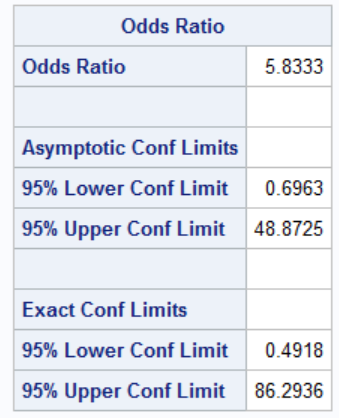
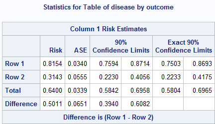
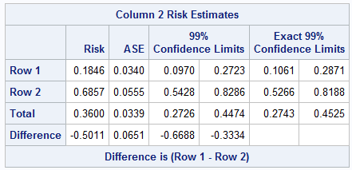
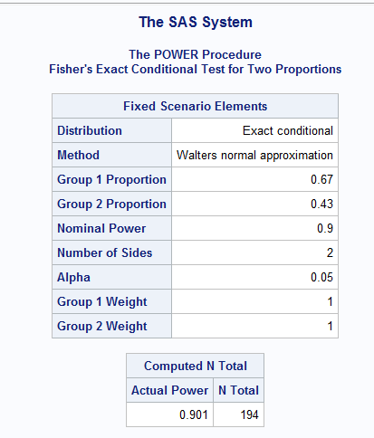
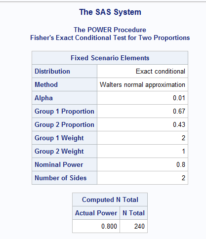
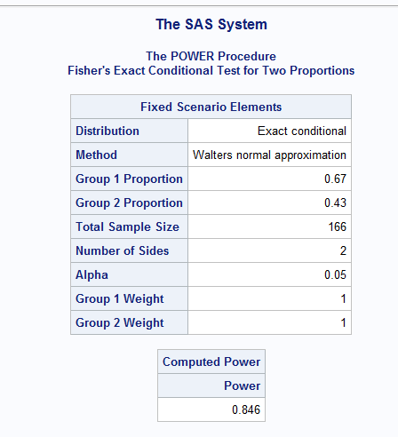

```{r setup, include=FALSE}
knitr::opts_chunk$set(echo = TRUE,message=F,warning=F)
```


```{r,echo=F}
library(tidyverse)
library(knitr)
library(kableExtra)
library(epitools)
```


# Problem 1

## part a

```{r}
ctab=function(a,b,c,d){
  tab=as.table(matrix(c(a,b,c,d),nrow=2,byrow = T))
  tab
}
```


```{r}
tab1=ctab(23,52,38,37)
tab=tab1%>%addmargins()
row.names(tab)=c("P","T","Total")
kable(tab,col.names = c("F","U","Total"))%>%kable_styling(full_width = F,position = "left")
```

## part b

```{r}
ci=function(p,n){
  se=sqrt(p*(1-p)/n)
  ci=c(p-1.96*se,p+1.96*se)
  ci
}
```


```{r}
p2=23/75
p1=38/75
n=75
ci1=ci(p2,n)
ci2=ci(p1,n)
```


$p=n_{i1}/n_i$

95% CI for $p$ : $p \pm 1.96 \sqrt{p(1-p)/n}$


$P=\frac{23}{75}\approx .307$ 30.7% favorable

95% CI: $(.202,.411)$

There is an estimated 30.7% favorable response in the test group with a 95% confidence interval of .202 and .411

Over repeated sampling we are 95% confident that the interval contains the true proportion of favorable responses

$T=\frac{38}{75}\approx .507$ 50.7% favorable

95% CI: $(.394,.620)$ 

There is an estimated 50.7% favorable response in the test group with a 95% confidence interval of .394 and .620

Over repeated sampling we are 95% confident that the interval contains the true proportion of favorable responses

## part c

```{r}
d=p1-p2
vd=function(p1,p2,n1,n2){
  v=p1*(1-p1)/n1+p2*(1-p2)/n2
  v
}
v=vd(p1,p2,75,75)
a=1.96*sqrt(v)+1/75
cid=c(d-a,d+a)
```

Difference=Test-Placebo

$d=p_1-p_2=.2$

The estimated difference in proportions is .2, the test group has an estimated proportion of favorable outcomes than the placebo group.

$v_d=\frac{p_1(1-p_1)}{75}+\frac{p_2(1-p_2)}{75}\approx .006$

95% CI for the difference in proportions: $d\pm 1.96\sqrt{v_d}+\frac{1}{2}\left[\frac{1}{75}+\frac{1}{75}\right]=(.033,.367)$

The 95% CI does not contain 0, the null value thus the difference in proportions is significant. That is the proption of favorable outcomes in the two groups are not equal.

## part d

```{r}
chisq.test(tab1,correct = F)
```

$\chi^2$ test

Two assumptions: each observation is independent and the row and column totals are fixed.

$H_0:$ There is no association between treatment and response (treatments have equal effects)

$\chi^2=6.217$ 

Using $\alpha=.05$ 

p-value=$.013<.05$ Thus reject $H_0$ 

There is evidence to suggest that there is an association between treatment and response (the treatments do not have the same proportion of favorable responses).

## part e

See parts b,c,d for interpretations

# Problem 2

## part a,b

```{r,echo=F}
center=c("A","A","B","B")
treat=c("H","L","H","L")
S=c(53,23,7,2)
U=c(17,35,3,5)
dat=tibble(center,treat,S,U)
```

```{r,echo=F}
a=dat%>%filter(center=="A")%>%select(-center)
b=dat%>%filter(center=="B")%>%select(-center)
```

```{r,echo=F}
atab=as.table(as.matrix(a[2:3]))
rownames(atab)=c("H","L")
btab=as.table(as.matrix(b[2:3]))
rownames(btab)=c("H","L")
kable(atab)
```


```{r}
cioddsr=function(ecases,enoncases,uecases,uenoncases){
  a=ecases
  b=enoncases
  c=uecases
  d=uenoncases
  or=(a/c)*(d/b)
  se=sqrt(1/a+1/b+1/c+1/d)
  z=c(-1.96,1.96)
  ci=exp(log(or)+z*se)
  c("Odds Ratio"=or,"95 CI"=ci)
}
```

```{r}
cioddsr(53,17,23,35)
```
The odds ratio for satisfactory response comparing high dose vs low dose in center A is 4.744 with a 95% CI (2.222,10.129)

## part c


The 95% CI for the odds ratio does not contain the null value 1, thus there is evidence of an association between dose group and response.

## part d

```{r}
kable(btab)
```


```{r echo=F,out.width = "20%"}

```

```{r}
fisher.test(btab)
```
The odds ratio for satisfactory response comparing high dose vs low dose in center b is 5.833. This means that the odds of a satisfactory response in the high doseage group are roughly 5.8 times as high as the odds for those in the low dosage group.

The table is sparse (not all values are at least 5) thus the usual
asymptotic confidence limits are not appropriate, we will obtain exact confidence limits for the odds ratio by using
the non-central hypergeometric distribution. 

95% CI (.492,86.294)
This is a much wider confidence interval than for center A.
The 95% CI for the odds ratio does contain 1 (the null value) thus there is not suffient evidence of an association between dose group and response for center B.

Fisher Exact Test:

$H_0$ : True odds ratio = 1

p-value= .153>.05

Thus fail to reject $H_0$, there is not suffient evidence of an association between dose group and response for center B.


# Problem 3

## part a

```{r,echo=F}
tabm=ctab(132,22,53,33)
colnames(tabm)=c("treatc","treatnc")
rownames(tabm)=c("placeboc","placebonc")
tabm=tabm%>%addmargins()
kable(tabm)
```

placebo clear proporiton $p_p=154/240\approx .642$

treatment clear proportion $p_t=185/240\approx .771$

```{r}
pval=1-pchisq(961/75,1)
mcnemar.test(tabm,correct = F)
```
Running a  McNemar test because we have matched pairs (left and right eye of each subject), the independence assumption between the eyes of each subject is violated.

$H_0:\pi_p=\pi_t$ There is a no difference between the proportion of clearance of proteins between the placebo and treatment groups.


$Q_M=\dfrac{(22-53)^2}{22+53}=12.813\approx \chi^2_1$

$\alpha=.05$

p-value$\approx.0003$

since p-value$<\alpha$ reject $H_0$ 

Conclude the there is a differnce in proportions of clearance between the two groups.

## part b

The results do not imply if the new treatment is more effective, they only imply that there is a difference in proportions of clearance between the two groups.

## part c

```{r}
p=131/240
se=(1/240)*sqrt(75-31^2/240)
```

difference in proportions

$p_t-p_p=\frac{185-154}{240}=\frac{131}{240}\approx .546$

$se(p_t-p_p)=\frac{1}{n}\sqrt{(n_{12}+n_{21})-\frac{(n_{12}-n_{21})^2}{n}}$

$=(1/240)\sqrt{(53+22)-(53-22)^2/n}\approx .035$

90% CI = $(p_t-p_p)\pm Z_{1-.1/2}*se=(.488,.604)$

# Problem 4

## part a

```{r,echo=F}
tab4=ctab(106,24,22,48)
colnames(tab4)=c("Test+","Test-")
rownames(tab4)=c("D+","D-")
tab4=tab4%>%addmargins()
kable(tab4)
```

senstitivity= $n_{11}/n_{1+}=106/130\approx .815$

specificity= $n_{22}/n_{2+}=48/70\approx .686$

## part b

```{r out.width = "40%",echo=F}

```

Exact 90% CI for sensitivity is $(.750,.869)$

## part c

```{r out.width = "40%",echo=F}

```


Exact 99% CI for specificity is $(.527,.819)$

## part d

$P(D+)=.7$  $P(D-)=.3$

$P(D-|T-)=\frac{P(T-,D-)}{P(T-)}=\frac{spec*.3}{spec*.3+(1-sens)*.7}\approx.614$

```{r}
sn=106/130
sp=48/70
```


# Problem 5

## part a

```{r out.width = "40%",echo=F}

```

Running fisher's exact conditonal test, we need a sample size of 194 to achieve .9 power using two-sided $\alpha=.05$

## part b

```{r out.width = "40%",echo=F}

```

To achieve .8 power with a two-sided $\alpha=.01$ with twice as many patients in the test treatment group as in the control group we need a sample size of 240.

## part c

```{r out.width = "40%",echo=F}

```

Under balanced allocation with a total sample size of 166, with two-sided $\alpha=.05$ the power is .846
