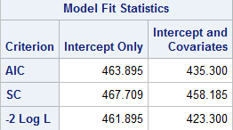
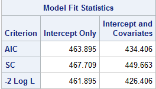
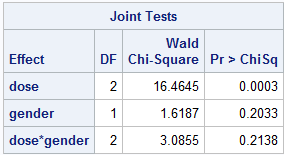
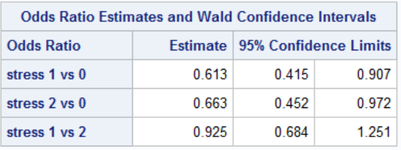
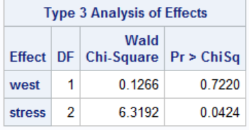
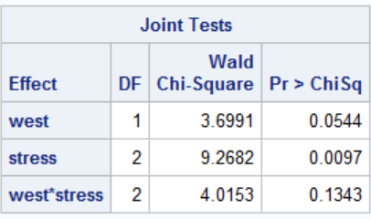
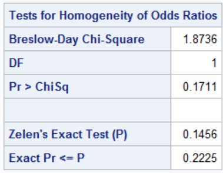

```{r setup, include=FALSE}
knitr::opts_chunk$set(echo = TRUE,message=F,warning = F)
```

```{r echo=F}
library(tidyverse)
library(knitr)
library(epitools)
library(oddsratio)
```

# Problem 1

## part a

__Explanatory Variables__

__high__: indicator of high dose

__low__: indicator of low dose

(placebo is 0 for both dose indicators)

__gender__: 1=Female 0=Male

__Outcome Variable__

__rash__:

0=severe or moderate 

1=mild or none


__Assumptions:__

Assume data arose from stratified simple random sample so that response is distributed binomially for each for each gender x dose combination

Each observation is independent from the others

The explanatory variables are linearly related to the log odds

There is little or no multicollinearity among the explanatory variables

```{r,echo=F}
rashd=matrix(c(
1,0, 0, 1, 16,
1, 0, 0, 0, 32,
1, 0, 1, 1, 21,
1, 0, 1, 0, 37,
0, 1, 0, 1, 16,
0, 1, 0, 0, 49,
0, 1, 1, 1, 27,
0, 1, 1, 0, 27,
0, 0, 0, 1, 34,
0, 0, 0, 0, 22,
0, 0, 1, 1, 39,
0, 0, 1, 0, 15),12,5,byrow = T)
cnames=c("high", "low", "gender", "rash", "count")
colnames(rashd)=cnames
rashdat=as_tibble(rashd)
rashdat$high=as.factor(rashdat$high)
rashdat$low=as.factor(rashdat$low)
rashdat$gender=as.factor(rashdat$gender)
rashdat$rash=as.factor(rashdat$rash)
kable(rashdat)
```

The reference group for gender is "male" the reference group for dose is "placebo"

$\theta_{hi}$ is the probability that person with hth gender receiving ith treatment has none or mild rash

h=1 female
h=2 male

i=1 high dose
i=2 low dose
i=3 placebo

$\alpha$ is the intercept

$\beta_1$ is incremental effect for high dose

$\beta_2$ is incremental effect for low dose

$\beta_3$ is incremental effect for female gender

$\beta_4$ and $\beta_5$ are the interaction terms

$logit(\theta_{hi})=\alpha+\beta_1I(high)+\beta_2I(low)+\beta_3I(female)+\beta_4I(high,female)+\beta_5I(low,female)$

$$\begin{bmatrix}
logit(\theta_{11})\\
logit(\theta_{12})\\
logit(\theta_{13})\\
logit(\theta_{21})\\
logit(\theta_{22})\\
logit(\theta_{23})\\
\end{bmatrix}= \begin{bmatrix}
\alpha+\beta_1+\beta_3+\beta_4\\
\alpha+\beta_2+\beta_3+\beta_5\\
\alpha+\beta_3\\
\alpha+\beta_1\\
\alpha+\beta_2\\
\alpha
\end{bmatrix}$$

$$=\begin{bmatrix}
110110\\
101101\\
100100\\
110000\\
101000\\
100000\\
\end{bmatrix}
=\begin{bmatrix}
\alpha\\
\beta_1\\
\beta_2\\
\beta_3\\
\beta_4\\
\beta_5\\
\end{bmatrix}
$$

```{r}
logit1<- glm(rash~high+low+gender+high*gender+low*gender,weights = count, data = rashdat, family = "binomial")
summary(logit1)
```

$logit(\theta_{hi})=.435+-1.129I(high)+-1.129I(low)+.520I(female)+-.393I(high,female)+.599I(low,female)$

Comparing the full model with interactions terms to the reduced model without the interaction terms and taking the difference in the likelihood

Full -2logL=423.300

Reduced -2logL=426.406

Difference = 3.106

$H_0:$ Interactions terms are 0

```{r}
(pval=1-pchisq(3.106,2))
```

The full model has 2 more parameters than the reduced model so we will compare the difference in likelihood to a chi square distribution with 2 degrees of freedom which gives us a pvalue of .212

Thus, the likelihood ratio test for the hypothesis that the additional terms in the expanded model are zero cannot be rejected

Conducting a joint Wald Chi square test on the interaction to assess whether the relationship between treatment and severity of rash after 2 weeks is the same for both males and females.

$H_0:$ There is no difference in the relationship between treatment severity of rash for males and females

$\chi^2=3.085$ p-value=.214

```{r}
(pval2=1-pchisq(3.085,2))
```


since p-value$>.05$ fail to reject the null hypothesis

The is not enough evidence to suggest that there is a difference in the relationship between treatment and severity of rash for males and females. This confirms the likelihood test result that the interaction term is non-significant.


```{r out.width = "25%"}



```


## part b

__Explanatory Variables__

__high__: indicator of high dose

__low__: indicator of low dose

(placebo is 0 for both dose indicators)

__gender__: 1=Female 0=Male

__Outcome Variable__

__rash__:

0=severe or moderate 

1=mild or none

The reference group for gender is "male" the reference group for dose is "placebo"

$\theta_{hi}$ is the probability that person with hth gender receiving ith treatment has none or mild rash

h=1 female
h=2 male

i=1 high dose
i=2 low dose
i=3 placebo

$\alpha$ is the intercept, the effect for the reference cell (male,placebo)

$\beta_1$ is incremental effect for high dose

$\beta_2$ is incremental effect for low dose

$\beta_3$ is incremental effect for female gender


$logit(\theta_{hi})=\alpha+\beta_1I(high)+\beta_2I(low)+\beta_3I(female)$

$$\begin{bmatrix}
logit(\theta_{11})\\
logit(\theta_{12})\\
logit(\theta_{13})\\
logit(\theta_{21})\\
logit(\theta_{22})\\
logit(\theta_{23})\\
\end{bmatrix}= \begin{bmatrix}
\alpha+\beta_1+\beta_3\\
\alpha+\beta_2+\beta_3\\
\alpha+\beta_3\\
\alpha+\beta_1\\
\alpha+\beta_2\\
\alpha
\end{bmatrix}$$

$$=\begin{bmatrix}
1101\\
1011\\
1001\\
1100\\
1010\\
1000\\
\end{bmatrix}
=\begin{bmatrix}
\alpha\\
\beta_1\\
\beta_2\\
\beta_3\\
\end{bmatrix}
$$

```{r}
mod2=glm(rash~high+low+gender,family="binomial",data = rashdat,weights=count)
summary(mod2)
```

$logit(\theta_{hi})=.396+-1.367I(high)+-1.254I(low)+.609I(female)$


```{r}
odds1=exp(.396-1.254+.609)
probnorash=odds1/(1+odds1)
probrash=1-probnorash
```


odds of none or mild rash for female low dose = $\exp(\hat{\alpha}+\hat{\beta_2}+\hat{\beta_3})=.780$

```{r}
newdat=data.frame("high"=0,"low"=1,"gender"=1)
newdat$high=factor(newdat$high)
newdat$low=factor(newdat$low)
newdat$gender=factor(newdat$gender)
odds=exp(predict.glm(mod2,newdata = newdat))
1-odds/(1+odds)
```

1-(odds no rash)/(1+odds no rash)=1-.438=.562

Predicted probability of moderate or severe rash after 2 weeks (rash=0) for females on low dose treatment is 56.2%


```{r}
ctab=function(a,b,c,d){
  tab=as.table(matrix(c(a,b,c,d),nrow=2,byrow = T))
  tab
}
```


```{r}
treat=rashdat%>%filter(low ==1 | high==1)%>%select(low,rash,count)
treat=treat%>%group_by(low,rash)%>%summarize(count=sum(count))
treat1=ctab(76,43,69,37)
rownames(treat1)=c("Low","High")
colnames(treat1)=c("Rash","No Rash")
treat1
oddsratio.wald(treat1,rev="rows")
```


Odds Ratio Estimate and 95% Confidence Interval comparing the odds of moderate or severe rash (rash=0) after 2 weeks on low dose to the odds on high dose

Odds Ratio=$\exp(-\beta_1)/\exp(-\beta_2)=.894$

95% CI= (.513,1.557)

The odds a of having moderate to severe rash after 2 weeks on the low dose are 1.055 times the odds for those in the high dose group. The confidence interval includes the null value, 1, thus the results are not significant.
There is not enough evidence to suggest that there is a difference in the odds ratio for moderate to severe rash between the high dose and low dose groups.

# Problem 2

## Part a

```{r}
data_2 <- tibble(region = as_factor(c("e", "e","e","e","e","e", "w", "w","w","w","w","w")), 
                 stress = as_factor(c("l", "l", "m", "m", "h", "h", "l", "l", "m", "m", "h", "h")),
                 response = c(1, 0, 1, 0, 1, 0, 1, 0, 1, 0, 1, 0), 
                 count = c(53,20,109,97,85,76,51,37,67,59,118,92))
dat2=data_2%>%mutate(west=as.numeric(region=="w"),stress=case_when(stress=="l"~0,stress=="m"~1,stress=="h"~2))
dat2=dat2%>%dplyr::select(west,stress,response,count)
dat2$stress=as.factor(dat2$stress)
```

__Explanatory Variables__

__Region__ indicator of west region (west=1)

__Stress__ level of stress: low=0 medium=1 high=2

__Response__ indicator of favorable response (favorable=1)

$\theta_{hi}$ is the probability that person from hth region with ith stress level has favorable response

$logit(\theta_{hi})=\alpha+\beta_1I(West)+\beta_2I(medium)+\beta_3I(high)$

$\alpha$ is the intercept, the effect for the reference cell (east coast,low stress level)

$\beta_1$ is incremental effect for the commuters from the West Coast

$\beta_2$ is incremental effect for medium stress level

$\beta_3$ is incremental effect for high stress level

## part b

```{r}
mods=glm(response~west+stress,weight=count,data=dat2,family=binomial(link="logit"))
summary(mods)
```

$logit(\theta_{hi})=.629+-.050I(West)+-.489I(medium)-.411I(high)$

The odds ratio estimate for the effect of high stress compared to low stress on favorable response is .663
and the 95% confidence interval for the odds ratio estimate is $(.281, 1.045)$ Since the interval includes the null value 1, the result is not significant.

To get the odds ratio by hand exponentiate the estimate for the high stress parameter

$\exp(-.411)$=.663

For the CI exponentiate the estimate $\pm$ 1.96 times the standard error for the estimate

$se=.195$

$(\exp(-.411-1.96*.195), \exp(-.411+1.96*.195)=(.281, 1.045)$


## part c

```{r out.width="25%"}

```


```{r}
c(1/0.925,1/1.251,1/0.684) 
```
Taking the reciprocal of the odds ratio of medium stress to high stress and the corresponding CI (In the sas table) gives us the the odds ratio estimate for the effect of high stress compared to medium stress on favorable response is 1.081
and the 95% confidence interval for the odds ratio estimate is (.799,1.462)

## part d

```{r out.width="25%"}

```

Conducting a Wald Chi-square test using $\alpha=.05$ to test if region has an effect on response

$H_0:$ Region has no effect on response

$\chi^2=.1266$ $p-value=.722$

Since p-value$>\alpha$ fail to reject the null hypothesis

There is not enough evidence to suggest region has an effect on response

## part e

```{r}
new=data.frame("west"=c(0,1,1),"stress"=c(0,1,2))
new$stress=factor(new$stress)
plo=predict.glm(mods,newdata=new)
exp(plo)/(1+exp(plo))
```


The predicted probability of favorable response for: 

1) An indivdual from an East Coast area with low stress is 65.2%

2) An indivdual from an West Coast area with medium stress is 52.2%

3) An indivdual from an West Coast area with high stress is 54.2%

## part f

```{r}
modi=glm(response~west+stress+west*stress,weight=count,data=dat2,family=binomial(link="logit"))
summary(modi)
```

To test the hypothesis that the model fit is adequate we will compare the full model with interactions terms to the reduced model without the interaction terms and taking the difference in the likelihood

Full -2logL=1175.1

Reduced -2logL=1179.2

Difference = 4.1 with 2 df (the difference in degrees of freedom between the two models)

$H_0:$ The interactions terms are nonsignificant (the model without interaction terms is an adequate fit)

```{r}
(pval=1-pchisq(4.1,2))
```

The full model has 2 more parameters than the reduced model so we will compare the difference in likelihood to a chi square distribution with 2 degrees of freedom which gives us a pvalue of .129

Since p-value$>\alpha$ fail to reject the null hypothesis

Thus, the likelihood ratio test for the hypothesis that the additional terms in the expanded model are zero cannot be rejected, this supports the main effects model being an adequate fit.

Also running a joint test on the interaction terms shows that it is nonsignificant.

```{r out.width="25%"}

```

$H_0:$ The interaction term is non-significant

$\chi^2=4.015$ with 2 df

p-value=$.134>.05$ Thus fail to reject the null hypothesis

conclude the interaction terms are nonsigificant

# Problem 3

## part a

__Assumptions:__

Assume data arose from stratified simple random sample so that response is distributed binomially for each for each severity x dose combination

Each observation is independent from the others

The explanatory variables are linearly related to the log odds

There is little or no multicollinearity among the explanatory variables

__Explanatory Variables__

__Severe__ indicator of baseline serverity: 0=moderate 1=severe

__High__ indicator of high dose treament

__Low__ indicator of low dose treament

(placebo is 0 for both dose indicators)

__Response__ indicator of no Chrohn's Disease

$\theta_{hi}$ is the probability that person from hth severity with ith dose has no Chron's Disease

$logit(\theta_{hi})=\alpha+\beta_1I(severe)+\beta_2I(high)+\beta_3I(low)$

$\alpha$ is the intercept, the effect for the reference cell (moderate severity,placebo treatment)

$\beta_1$ is incremental effect for the severe baseline severity

$\beta_2$ is incremental effect for high dose

$\beta_3$ is incremental effect for low dose

$logit(\theta_{hi})=-3.221+-1.793I(severe)+2.267I(high)+1.938I(low)$

## part b

```{r}

```

Odds ratio for Severe to Moderate, for Placebo

Model1 $\exp(-1.793)=.167$

Model2 $\exp(-1.933)=.145$


Odds ratio for Severe to Moderate, for Low dose

Model1 $\exp(-1.793+-3.221+1.938)/\exp(-3.221+1.938)=\exp(-1.793)=.167$

Model2 $\exp(-2.527+-1.933+3.812+.064)/\exp(-2.527+3.812)=\exp(-1.933+.064)=.154$


Odds ratio for High dose to Placebo, for Moderate baseline

Model1 $\exp(2.267)=9.650$

Model2 $\exp(2.005)=7.426$


Odds ratio for High dose to Placebo, for Severe baseline

Model1 $\exp(2.267+-1.793+-3.221)/\exp(-1.793+-3.221)=\exp(2.267)=9.650$

Model2 $\exp(2.005+.969)=19.57$

## part c

With model 1 rows one and two will have the same value since there is no interaction term and the coeffiecent for low dose divides out. For model 2 rows one and two will have different values because of the interaction term between severe baseline and low dose.

With model 1 rows three and four will have the same value since there is no interaction term and the coeffiecent for severe baseline divides out. For model 2 rows three and four will have different values because of the interaction term between severe baseline and high dose.

## part d

### Model 1

The low dose parameter is the incremental effect for low dose treatment, and exponentiating it gives you the odds ratio of no Crohn's disease for low dose compared to placebo.

95% confidence interval and estimate for the odds ratio of no Crohn’s
disease (vs. otherwise) for High dose versus Placebo, controlling for baseline severity

With incremental effects parameterization for a main effects model the odds ratios have been adjusted for all other explanatory variables in the model thus exponentiating the parameter estimate for high dose gives us the odds ratio

$\exp(2.267)=9.650$ 95% CI: $\exp(2.267 \pm 1.96*.522)=(3.469,26.846)$

```{r}
c(exp(2.267-1.96*.522),exp(2.267+1.96*.522))
```

### Model 2

Predicted probability of no Crohn’s disease for an individual on low dose who had severe pain at baseline is 36.8%

```{r}
logodds=-2.527+-1.933+3.812+.064
(prob=exp(logodds)/exp(1+logodds))
```

## part e

Assessing the hypothesis that Model 1 has satisfactory goodness of fit in the sense that any association between baseline severity and probability of no Crohn’s disease post-treatment is homogeneous across the placebo, low dose, and high dose groups using an alpha value of .05

```{r}
(l1=-2*-159.743)
(l2=-2*-157.872)
l1-l2
```

To test the hypothesis that the model fit is adequate we will compare the full model with interactions terms to the reduced model without the interaction terms and taking the difference in the likelihood

Model 1 -2LogL=319.486

Model 2 -2LogL=315.744

Difference= 3.742 with 2 df

```{r}
1-pchisq(3.742,2)
```

$H_0:$ The interactions terms are nonsignificant (the model without interaction terms is an adequate fit)

The full model (model 2) has 2 more parameters than the reduced model (model 1) so we will compare the difference in likelihood to a chi square distribution with 2 degrees of freedom which gives us a pvalue of .154

Since p-value$>\alpha$ fail to reject the null hypothesis

Thus, the likelihood ratio test for the hypothesis that the additional terms in the expanded model are zero cannot be rejected, conclude that the model 1 is an adequate fit.

# Problem 4

## part a

```{r}
male=ctab(10,18,2,10)
female=ctab(22,37,15,19)
cnames=c("acc.after","noacc.after")
rnames=c("acc.before","noacc.before")
colnames(male)=cnames
rownames(male)=rnames
colnames(female)=cnames
rownames(female)=rnames
all=male+female
addmargins(all)
```


Conducting a chi-square test to determine if the proportion of diabetic patients with ACCs after
using the disinfectant differs between diabetic patients with and without ACC before
using the disinfectant, ignoring sex.

Using $\alpha=.05$

$H_0:$ The proportions of diabetic patients with ACCs after using the disinfectant are equal for diabetic patients with and without ACC before using the disinfectant

```{r}
dat=array(c(10,18,2,10,22,37,15,19),dim=c(2,2,2))
chi=(32*29-17*55)^2/(86*46*49*84)
pval=1-pchisq(chi,1)
chisq.test(matrix(c(32,55,17,29),nrow=2),correct = F)
```

$\chi^2=.0004$ p-value=$.984>.05$ Fail to reject the null hypothesis

There is no evidence to suggest that the proportion of diabetic patients with ACCs after using the disinfectant differs between diabetic patients with and without ACC before using the disinfectant.

## part b

Testing the association between the ACC status at baseline and the occurrence of ACC vs not after disinfectant use, considering each sex separately

Male sex:

The 2x2 table for males is sparse so conducting a Fishers Exact test

$H_0:$ There is no assocation between the ACC status at baseline and the occurrence of ACC vs not after disinfectant use

```{r}
fisher.test(male)
```
p-value=.2848>.05 Thus fail to reject the null hypothesis

Not enough evidence to suggest there is an association between ACC status at baseline and the occurrence of ACC vs not after disinfectant use

Female sex:

The 2x2 table for females is not sparse thus we can conduct a chi square test for association

$H_0:$ There is no assocation between the ACC status at baseline and the occurrence of ACC vs not after disinfectant use.

```{r}
chisq.test(female,correct=F)
```

$\chi^2=.420$ p-value=$.517>.05$ Thus fail to reject the null hypothesis

Not enough evidence to suggest there is an association between ACC status at baseline and the occurrence of ACC vs not after disinfectant use.

## part c

```{r}
oddsratio.wald(male,rev="rows")
```

```{r}
oddsratio(female,rev="rows")
```


Looking at the wald odds ratios for the males and females separately, there appears to be a big difference.

The odds ratio of the occurence of ACC after disinfectant use for diabetic patients with ACC at baseline compared to those without for males is .360

For females the odds ratio is 1.324

This is a large difference and it appears that the association differs between males and females.

## part d

Conducting a Zelen Test using $\alpha=.05$ to test the association between ACC status at baseline and ACC after disinfectant use controlling for sex.

The null hypothesis is that pooled baseline ACC is not associated with occurrence of ACC after disinfectant use, controlling for sex (odds ratio=1 within strata)

```{r out.width='25%'}

```


p-value=$.1456>\alpha$ Thus fail to reject the null hypothesis

Not enough evidence to suggest the association between ACC status at baseline and ACC after disinfectant use differs between males and females

This suggest homogeniety of the odds ratios.

## part e

For part a I ran a chi square test for difference in proportions since we are ignoring sex it is essentially one 2x2 table

For part b I ran a fishers exact test on the male 2x2 table since the table is sparse. The female table is not sparse so I ran a chi square test for proporitons

For part c I compared the odds ratios for each gender to see if there was a big difference between the two

For part d I used a zelen test to adjust for sex, and conduct a single analysis of homogeneity of the odds ratios for the two sex strata