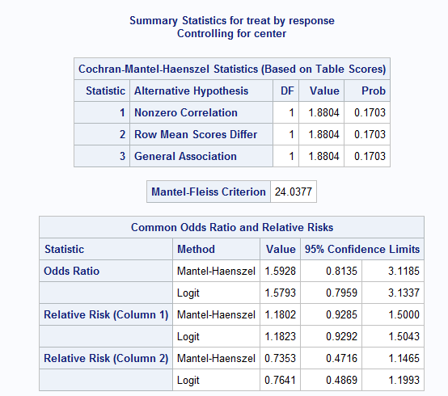
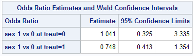
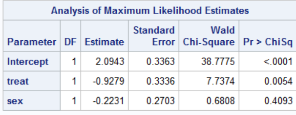
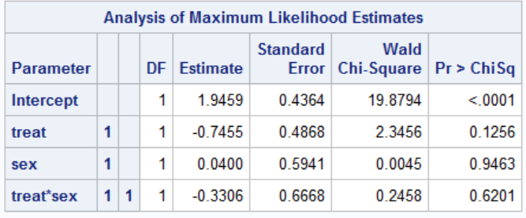
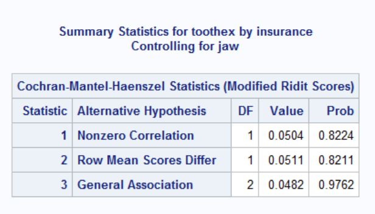
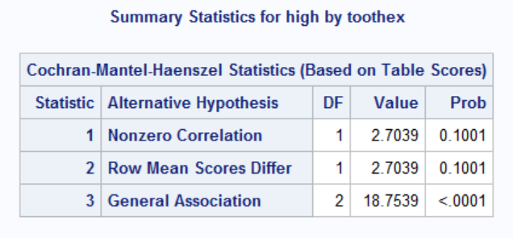
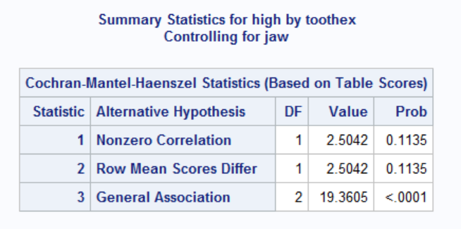
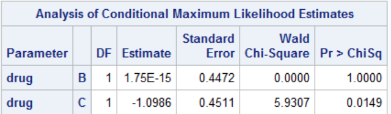
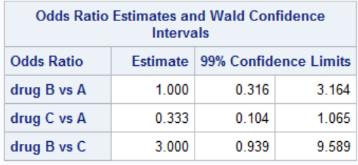
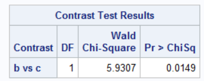

```{r setup, include=FALSE}
knitr::opts_chunk$set(echo = TRUE,message=F,warning=F)
```

```{r include=F}
library(tidyverse)
library(knitr)
library(epitools)
library(DescTools)
```

```{r include=F}
ctab=function(a,b,c,d){
  tab=as.table(matrix(c(a,b,c,d),nrow=2,byrow = T))
  tab
}
```


```{r include=F}
cioddsr=function(ecases,enoncases,uecases,uenoncases){
  a=ecases
  b=enoncases
  c=uecases
  d=uenoncases
  or=(a/c)*(d/b)
  se=sqrt(1/a+1/b+1/c+1/d)
  z=c(-1.96,1.96)
  ci=exp(log(or)+z*se)
  c("Odds Ratio"=or,"95 CI"=ci)
}
```


# Problem 1

## part a

```{r}
a=ctab(22,13,33,19)
b=ctab(27,7,18,15)
rnames=c("good","poor")
cnames=c("test","placebo")
rownames(a)=rnames
colnames(a)=cnames
rownames(b)=rnames
colnames(b)=cnames
```


```{r}
oddsratio.wald(a)
```

```{r}
oddsratio.wald(b)
```

The odds ratio between test treatment and placebo for good versus poor response for center A is .974 At center A the odds of a good response for the test group are .974 times the odds of a good response for the placebo group. These methods are justified because each cell count is at least 10.

The 95% CI is $(.401,2.368)$ The interval includes the null value 1, so the results are not significant.

The odds ratio between test treatment and placebo for good versus poor response for center B is 3.214. At center B the odds of a good response for the test group are 3.124 times the odds of a good response for the placebo group.
 
The 95% CI is $(1.095,9.439)$ The interval does not contain the null value 1, so the results are significant. These methods are justified because each cell count is at least 5.

## part b

For Center A, provide and interpret the results of a statistical test for the association
between treatment and response using the two-sided 0.05 significance level. Repeat
separately for Center B

```{r}
chisq.test(a,correct=F)
chisq.test(b,correct=F)
```

Conducting a chi-square test for the association between treatment and response for center A.

$H_0:$ There is no association between treatment and response

$\chi^2=.003$ p-value$=.954>.05$ Thus fail to reject the null hypothesis

Not enough evidence to suggest an association between treatment and response at center A

Conducting a chi-square test for the association between treatment and response for center B.

$H_0:$ There is no association between treatment and response

$\chi^2=4.695$ p-value$=.03<.05$ Thus reject the null hypothesis

There is evidence to suggest an association between treatment and response at center B

## part c

```{r}
gi=tibble(center=rep(c("a","a","b","b"),times=2),
treat=rep(c("test",'placebo'),times=4),response=c(rep(1,4),rep(0,4)),
count=c(22,33,27,18,13,19,7,15))
```

Under minimal assumptions, assess the association between treatment and response,
controlling for center, with a statistical test at the two-sided 0.05 level. Briefly
justify your methods and interpret the results

The Mantel-Fleiss criterion requires that the across-strata sum of expected values for a particular cell has a difference of at least 5 from both the minimum possible sum and the maximum possible sum of the observed values in order for the chi-square approximation to be appropriate for the distribution of the Mantel-Haenszel statistic for 2 strata.

```{r out.width="50%"}

```


The Mantel-Fleiss crierion is 24.038 which is greater than 5.
Thus the chi-square approximation is appropriate for the Mantel-Haenszel statistic.

Estimate for common odds ratio is $1.593$ comparing test treatment to placebo for good versus poor response. On average, those with treatment had 1.593 times the odds of having a good response than those with placebo 

Conducting a Mantel-Haenszel test

$H_0:$ Ttreatment is not associated with response, controlling for center

Mantel_Hanszel $\chi^2$=1.88 with 1 df p-value=.17>.05 Thus fail to reject the null hypothesis

Not enough evidence to suggest an association between treatment and response, adjusting for center.


```{r}
tab=array(c(a,b),dim=c(2,2,2))
mantelhaen.test(tab,correct = F)
```

## part d

Assess the homogeneity of the odds ratio across the two centers

```{r}
BreslowDayTest(tab)
```

Conducting a Breslow-Day test for homogeneity of odds ratios across the centers

$H_0:$ The odds ratios are homogeneous across the centers

$\chi^2=2.841$ with 1 df p-value$=.092>.05$ Thus fail to reject the null hypothesis

There is not enough evidence to reject the null hypothesis that the odds ratios comparing test vs placebo are homogeneous across centers. We can conclude that the odds ratios for the two centers can reasonably be considered homogeneous.

## part e

Provide a corresponding 95% confidence interval for the quantity in part d

For the results of part c, the common odds ratio estimate $1.593$ with 95% CI: $(.813,3.119)$ On average, those with treatment had 1.593 times the odds of having a good response than those with placebo 

Since the interval contains the null value 1, the results are not significant, which supports the conclusion that the odds ratio do not differ signicantly.

# Problem 2

## part a

```{r}
rashdat=tibble(treat=c("p","p","l","l","h","h"),sex=rep(c("M","F"),times=3),none=c(6,7,9,10,19,21),mild=c(10,14,7,17,15,18),mod=c(12,19,30,11,17,10),sev=c(20,18,19,16,5,5),total=c(48,58,65,54,56,54))
```

Under minimal assumptions (not involving a formal statistical model), conduct a
statistical test to assess the association of pooled test treatments (high or low) vs.
placebo with presence of rash after 2 weeks of treatment, controlling for gender.


```{r}
pooled=rashdat%>%mutate(treat=as.numeric((treat!="p")),rash=total-none)%>%select(treat,sex,rash,none)%>%group_by(treat,sex)%>%summarize(rash=sum(rash),none=sum(none))
rnames=c("test","placebo")
cnames=c("rash","norash")
tnames=c("male","female")
m=ctab(93,28,42,6)
f=ctab(77,31,51,7)
rownames(m)=rnames
colnames(m)=cnames
rownames(f)=rnames
colnames(f)=cnames
ptab=array(c(m,f),dim=c(2,2,2),dimnames = list(rnames,cnames,tnames))
ptab
mantelhaen.test(ptab,correct = F)
```

Running a Mantel-Haenszel test to assess the association of the pooled test treatments vs placebo with presence of rash, controlling for sex.
Common odds ratio estimate= .397 (comparing presence of rash in treatment groups vs placebo, controlling for sex). On average, those with treatment had .397 times the odds of occurence of rash than those with placebo  

The 95% CI is $(.207,.763)$. Since the interval does not contain the null value 1, the results are significant.

$H_0$ Pooled test treatment is not associated with presence of rash, controlling for sex
 
$\chi^2$ = 8.051 with 1 df p-value=.005<.05 Thus reject $H_0$

There is evidence to suggest an association between pooled treatment and presence of rash, controlling for sex.

## part b

Provide an odds ratio and 95% confidence interval that describe the effect of pooled
(high or low dose) treatment vs. placebo on presence of rash after 2 weeks for each
of the following:

i. Females only.

```{r}
oddsratio.wald(f)
```

The odds ratio comparing test to placebo for females is .341 with a 95% CI $(.140,.833)$ The interval,does not contain the null value 1, thus the results are significant

ii. Males only.

```{r}
oddsratio.wald(m)
```

The odds ratio comparing test to placebo for males is .474 with a 95% CI $(.183,1.232)$ The interval contains the null value 1, thus the results are not sigificant.

iii. Controlling for gender. You should address the assumption that the effect of pooled (high or low dose) treatment vs. placebo on presence of rash after 2 weeks treatment is similar in both males and females.

Common odds ratio estimate= .397 (comparing presence of rash in treatment groups vs placebo, controlling for sex). On average, those with treatment had .397 times the odds of occurence of rash than those with placebo. The 95% CI is $(.207,.763)$. Since the interval does not contain the null value 1, the results are significant. Since the interval does not contain the null value 1, the results are significant. This suggests a statistically significant association between the effect of pooled treatment on presence of rash. 

```{r}
BreslowDayTest(ptab)
```
Conducting a Breslow-Day test for homogeneity of odds ratios

$H_0:$ Odds ratios are homogeneous across sex

$\chi^2=.246$ with 1 df p-value$=.62>.05$ Thus fail to reject $H_0$

There is not enough evidence to reject the null hypothesis that the odds ratios comparing test vs treatment occurence of rash for males and females are homogeneous. We can conclude that the odds ratios for males and females can reasonably be considered homogeneous.


## part c

Fit logistic regression models for the presence of rash after 2 weeks with exaplantory
variables for pooled (high or low dose) treatment vs. placebo and for female vs. male,
using placebo and male as reference groups for the following:

```{r}
pooled1=pooled%>%mutate(sex=as.numeric(sex=="F"))
pooledat=tibble(treat=rep(pooled1$treat,2),sex=rep(pooled1$sex,2),rash=c(rep(1,4),rep(0,4)),count=c(pooled1$rash,pooled1$none))
```


### main effects

main effects model: provide gender-specific odds ratios and their
corresponding 95% confidence intervals.

```{r}
pmod1=glm(rash~treat+sex,weights = count,family = "binomial",data = pooledat)
summary(pmod1)
```

__Explanatory Variables__

__Treat__ indicator of pooled treatment

__Sex__ indicator of female sex


__Rash__ indicator of rash occurrence (rash=1)

$\theta_{hi}$ is the probability that person from hth treatment group with ith sex level has rash occurrence

$logit(\theta_{ij})=2.094+-.928Treat+-.223Sex$

The odds ratio of rash occurence of females to males is $\exp(-.223)=.8$ The odds of rash occurence for females is .8 times the odds of rash occurrence in males. The 95% CI is $(.471,1.359)$

### main effects plus interaction

main effects plus two-way interaction model: provide gender-specific odds ratios and their corresponding 95% confidence intervals

```{r}
pmod2=glm(rash~treat+sex+treat*sex,weights = count,family = "binomial",data = pooledat)
summary(pmod2)
```

__Treat*Sex__ Two-way interaction term between treatment and sex

$logit(\theta_{ij})=1.946+-.746Treat+.04Sex+-.331Treat*Sex$

```{r out.width="40%"}

```


Odds ratio for females to males in placebo group:

$\exp(.04)=1.041$ The odds of rash occurence for females in the placebo group is 1.041 times the odds of rash occurrence in males in the placebo group. The 95% Confidence interval is $(.325,3.335)$

Odds ratio for females to males in pooled treatment group:

$\exp(.04+-.33058)=.748$ The odds of rash occurence for females in the pooled treatment group is .748 times the odds of rash occurrence in males in the pooled treatment group. The 95% CI is $(.413,1.354)$

## part d

Do parts a through c agree? Briefly comment on your findings in 1-2 short sentences

The results from part a suggest that pooled treatment and presence of presence of rash are accociated when controlling for sex. From part b, the odds ratio controlling for gender, comparing presence of rash in the pooled treatment group to the placebo group was .397, which suggests that the treatment is associated with rash reduction. This is in agreement with part a. The odds ratio for females only was .341 and the odds ratio for males only was .474 (although the confidence interval included the null value). Thus parts a and b are in agreeement. From part c the odds ratio of rash occurence from the main effects model of females to males was .8 but the 95% CI included the null value so the results were not siginifcant. In both the main effects model and the interaction model, sex was not significant, the main effects model had a p-value for sex of .41 and the interaction model had a p-value for sex of .95. Also the interaction term between treatment and sex was non-significant with a p-value of .62


```{r out.width="40%"}

```


```{r out.width="40%"}

```


# Problem 3

## part a

```{r}
teeth=tibble(toothex=c("none","none","one","one","2+","2+"),jaw=rep(c("upper","lower"),times=3),low=c(279,149,69,29,45,21),med=c(193,83,21,44,33,12),high=c(373,137,81,75,24,19))
```

Under minimal assumptions, conduct a statistical test to determine whether there is a
location shift across degree of insurance coverage when comparing between no tooth
extraction and one or more teeth extraction, while controlling for type of jaw.

```{r}
teeth1=teeth%>%mutate(toothex=as.numeric(toothex!="none"))%>%group_by(toothex,jaw)%>%summarize(low=sum(low),med=sum(med),high=sum(high))
u=teeth1%>%filter(jaw=="upper")%>%select(jaw,toothex,low,med,high)
l=teeth1%>%filter(jaw=="lower")%>%select(jaw,toothex,low,med,high)
```

```{r out.width="40%"}

```

Running an extension Mantel-Haenszel test to test the null hypothesis that there is no location shift across degree of insurance coverage when comparing between no tooth extraction and one or more teeth extraction, while controlling for type of jaw. Since we can't say that the response levels for degree of insurance coverage are equally spaced, using the modified ridit score in the computation of $Q_{SMH}$

$Q_{SMH}=.0511$ with df=1 p-value=.821>.05 

Fail to reject the null hypothesis, conclude there is no location shift across degree of insurance coverage when comparing between no tooth extraction and one or more teeth extraction, while controlling for type of jaw.

## part b

Please specify which tooth extraction tends to demonstrate a higher degree of
insurance coverage if the result in part a) is shown to be statistically significant.

The results from part a were non-significant


## part c

Under minimal assumptions, conduct a statistical test to determine whether there is a
trend in the proportion of degree of high insurance (versus not) across the ordered levels
of number of extracted teeth ignoring any effect of jaw.

```{r}
teeth2=teeth%>%mutate(not_high=low+med,toothex=case_when(toothex=="none"~0,toothex=="one"~1,TRUE~2))%>%select(not_high,high,toothex)%>%group_by(toothex)%>%summarize(not_high=sum(not_high),high=sum(high),prophigh=high/(not_high+high))
teeth2
```

```{r out.width="40%"}

```

Conducting a Mantel-Haenszel test to determine whether there is a
trend in the proportion of high insurance across the ordered levels of number of extracted teeth ignoring jaw type.

$H_0$ There is no trend in proportion of high insurance across tooth extraction level.

$Q_S=2.704$ with 1 df p-value$=.1001>.05$ Thus fail to reject the null hypothesis, conclude there is not a trend in proportion of high insurance across tooth extraction level, ignoring jaw type.

## part d

Under minimal assumptions, conduct a statistical test to determine whether there is a trend in the proportion of high insurance (versus not) across the ordered levels of number of extracted teeth, controlling for jaw

```{r}
teeth3=teeth%>%mutate(not_high=low+med,toothex=case_when(toothex=="none"~0,toothex=="one"~1,TRUE~2))%>%select(jaw,toothex,not_high,high)%>%arrange(jaw)
teeth3
```

```{r out.width="40%"}

```

Running an extension Mantel-Haenszel test to test the null hypothesis that there is trend in proportion of high insurance across ordered tooth extraction level, controlling for jaw type.

$Q_{SMH}=2.504$ with 1 df p-value$=.1135>.05$ Thus fail to reject the null hypothesis, conclude there is not trend in proportion of high insurance across ordered tooth extraction level, controlling for jaw type.


# Problem 4

## part a

```{r}
drugs=tibble(druga=c(rep("f",times=4),rep("u",times=4)),drugb=rep(c("f","f","u","u"),times=2),drugc=rep(c("f","u"),times=4),count=c(6,16,2,4,2,4,6,6))
```

Fit a conditional logistic regression model describing the relationship of favorable response to the treatments, conditioning on patient. Use drug A as the reference category. Report a table of all parameter estimates and their standard errors

```{r out.width="40%"}

```

Running a conditional logistic regression model in SAS using drug A as the reference category and conditioning on patient.

Drug B Estimate $<.001$ Standard error .447

Drug C Estimate $-1.099$ Standard Error .451

## part b

Provide appropriate measures of association and 99% confidence intervals for the effects
of treatments relative to one another for favorable response, while conditioning on the
patient effect

```{r out.width="40%"}

```

The Odds Ratio of the effects of each drug relative to each other for favorable response and corresponding 99% CI:

Drug B to A OR=1      99% CI: $(.316,3.164)$

Drug C to A OR=.333   99% CI: $(.104,1.065)$

Drug B to C OR= 3     99% CI: $(.939,9.589)$

## part c

Using this model with drug A as reference, perform a hypothesis test to compare drug B to drug C at the 0.05 significance level. Justify your choice of methods and interpret the results


Using contrast to preform a Wald test comparing the effect on favorable response of drug B vs drug C

$H_0:B-C=0 $ There is no difference in favorable response between drug B and drug C

```{r out.width="40%"}

```

$\chi^2=5.931$ with 1 df $p-value=.015<.05$

Thus reject $H_0$ and conclude there is a difference in favorable response between drug B and drug C. Given these results and the that the odds ratio of favorable response comparing Drug B to drug C, conditioning on patient effect is 3, this suggests that drug B is more effective than drug C.

