```{r setup, include=FALSE}
knitr::opts_chunk$set(echo = TRUE,message=F,warning=F)
```

```{r}
library(tidyverse)
library(knitr)
```

# Problem 1

```{r}
dat=matrix(c(62,70,65,67,78,68,35,21,18,
19,14,15,19,27,24,45,33,24,
21,22,19,50,38,29,19,14,15),byrow=T,nrow=9)
initial=c(rep("none",3),rep("low",3),rep("avg",3))
loc=rep(c("e","mw","w"),3)
dat1=as_tibble(cbind(initial,loc,dat))
cnames=c("initial","loc","low","med","high")
colnames(dat1)=cnames
```


## part a

Mathematically specify a proportional odds regression model for response (ordered
from low to high) with main effects for location and initial level of motivation. State the
model assumptions, and interpret all model parameters. Assess goodness of fit of the
proportional odds model, and justify your method.


__Assumptions__ 

observations in the data set are independent

data arises from a stratified simple random sample

model fits the data adequately

Proportional odds assumption: $\boldsymbol{\beta}_k=\boldsymbol{\beta}$ for all k

__Explanatory Variables__

avg: indicator of average initial motivation

low: indicator of low initial motivation

mw: indicator of midwest location

w: indicator of west location

__Response__

$k_{th}$ response 1=high 2=medium 3=low (ordered from low to high)

__Proportional Odds Model__

$logit(\theta_{ik})=\alpha_k+\boldsymbol{x}^{\prime}_{i}\boldsymbol{\beta}$

$logit(\theta_{i1})$ is the log odds of high response to low or medium response

$logit(\theta_{i2})$ is the log odds of high or medium response to low response

where $i= 1, 2,\dots,9$ references the 9 populations determined by the levels of initial level of motivation and location as ordered in the table below

```{r out.width="30%", echo=F}
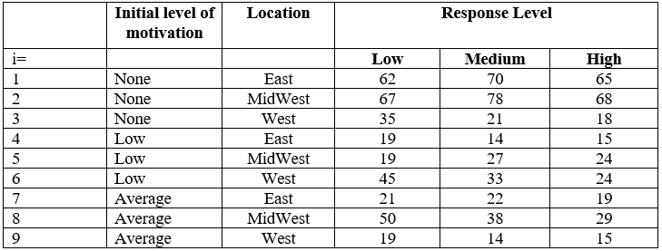
```


__Parameters__

$\alpha_1$ log odds of high response to low or medium response for patients with none initial motivation from the east

$\alpha_2$ log odds of high or medium response to low response for patients with none initial motivation from the east

$\beta_1$ Increment for both types of log odds due to average initital motiviation

$\beta_2$ Increment for both types of log odds due to low initial motivation

$\beta_3$ Increment for both types of log odds due to midwest location

$\beta_4$ Increment for both types of log odds due to west location

```{r out.width="30%",echo=F}
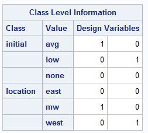
```

```{r out.width="45%",echo=F}
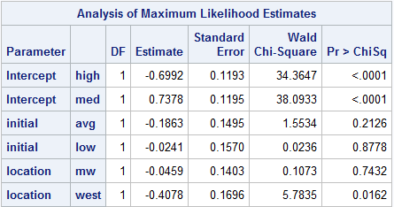
```

$logit(\theta_{ik})=\alpha_1+\alpha_2+\beta_1 avg+\beta_2 low+\beta_3 mw+\beta_4 west$

$logit(\theta_{ik})=-.699+.7378+-.186avg+.024 low+-.046mw+-.408 west$

__Goodness of fit__

Since at least 80% of observed cell counts are greater than 5 we can use the $Q_L$ and $Q_P$ to assess goodness of fit

Essentially a $\chi^2$ test for goodness of fit.

$H_0:$ The model fit is adequate

$Q_L$ and $Q_P$ $\sim \chi^2_{12}$

$Q_L=8.48$ df=12 p-value $=.747$

$Q_P=8.68$ df=12 p-value $=.73$

Since both p-values are significantly large, we fail to reject the null hypothesis that the model fit is adequate

Thus $Q_L$ and $Q_P$ support the adequacy of the model

```{r out.width="30%",echo=F}
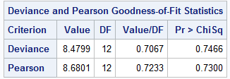
```


## part b

Conduct a statistical test to assess whether proportional odds across both explanatory
variables is a reasonable assumption for these data. Write a sentence explaining the results
of your test.

Score test for the proportional odds assumption

$H_0: \beta_k=\beta$ for all k 

This determines whether, if we fit a different set of explanatory variable parameters $\beta_k$ for each logit function, those sets of parameters are equivalent. If the null hypothesis is not rejected, then the test supports the assumption of proportional odds

```{r out.width="30%",echo=F}
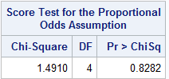
```


$Q_{RS}=1.491\sim \chi^2_4$ p-value$=.828$

Fail to reject $H_0$ Thus, the proportional odds assumption is not contradicted

## part c

Test whether initial level of motivation at 0.05 significance level has an effect on response.
Write a sentence explaining your results.

```{r out.width="30%",echo=F}
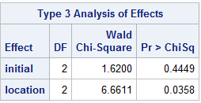
```

Conducting a joint test to assess whether initial level of motivation has an effect on response

$H_0:$ initial level of motivation has no effect on response

Wald $\chi^2=1.62$ with df=2 p-value$=.445>.05$ Thus fail to reject $H_0$

Conclude initial level of motivation does not a have statistically significant effect on response

## part d

Provide an estimate and 95% confidence interval for the odds ratio of high vs. (low or
medium) response comparing a ‘low’ initial level of motivation with those having ‘none’;
repeat for ‘average’ vs. ‘none’. What do you conclude about the statistical significance
of these effects from their confidence intervals? Briefly discuss how these estimates
compare to comparable estimates for (high or medium) vs. low.

odds ratio of high vs. (low or medium) response comparing low initial motivation to none

OR= $\exp(\alpha_1+\beta_2)/\exp(\alpha_1)=\exp(\beta_2)=.976$

95% CI $(.718,1.328)$ Since the interval includes the null value 1, the results are not significant

odds ratio of high vs. (low or medium) response comparing average initial motivation to none

OR=$\exp(\alpha_1+\beta_1)/\exp(\alpha_1)=\exp(\beta_1)=.83$

95% CI $(.619,1.113)$ Since the interval includes the null value 1, the results are not significant

Since both confidence intervals contain the null value, conclude the effect of initial motivation is not statistically significant. This is in agreement with the joint test of the effect of initial motivation on response from part c.

The corresponding estimates are the same for (high or medium) vs low response since the $\beta$ parameters are incremental effects for both types of log odds.

```{r out.width="30%",echo=F}
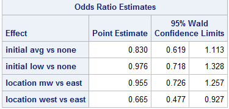
```


# Problem 2

## part a

Mathematically specify and fit a generalized logits regression model for response, treating
(low, medium, and high) as nominal instead of ordinal. Include main effects for initial
level motivation and location. Let “medium” be your reference for the response. State
assumptions, and interpret all model parameters.

__Assumptions__ 

observations in the data set are independent

data arises from a stratified simple random sample

model fits the data adequately

__Generalized Logits Model__

$logit_{hij}=\alpha_j+\boldsymbol{x}^{\prime}_{hi}\boldsymbol{\beta}_j$

h=1,2,3 for none, low and average initial level of motivation respectively

i=1,2,3 for the east, midwest and west locations respectively

j=1,2 for response 1=high 2=low (medium is the reference)

$logit_{hi1}=\log(\pi_{hi1})/log(\pi_{hi\text{medium}})$ the logit comparing high response to medium response

$logit_{hi2}=\log(\pi_{hi2})/log(\pi_{hi\text{medium}})$ the logit comparing low response to medium response

__Parameters__

$\alpha_1$ intercept for $logit_{hi1}$ for none initial motivation, east location

$\alpha_2$ intercept for $logit_{hi2}$ for none initial motivation, east location

$\beta_1$ incremental effect for average initital motiviation for $logit_{hi1}$ 

$\beta_2$ incremental effect for average initital motiviation for $logit_{hi2}$

$\beta_3$ incremental effect for low initital motiviation for $logit_{hi1}$

$\beta_4$ incremental effect for low initital motiviation for $logit_{hi2}$

$\beta_5$ incremental effect for midwest location for $logit_{hi1}$

$\beta_6$ incremental effect for midwest location for $logit_{hi2}$

$\beta_7$ incremental effect for west location for $logit_{hi1}$

$\beta_8$ incremental effect for west location for $logit_{hi2}$


```{r out.width="45%",echo=F}
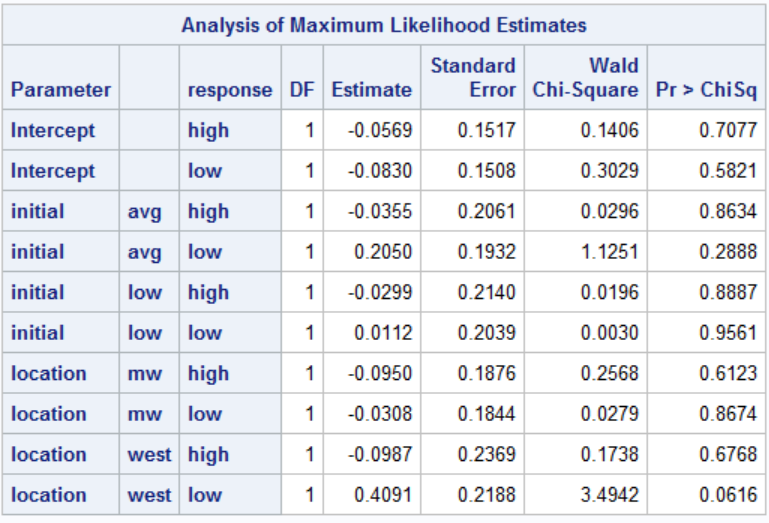
```

__Parameter Estimates__

$\alpha_1=-.057$

$\alpha_2=-.083$

$\beta_1=-.036$ 

$\beta_2=.205$ 

$\beta_3=-.03$ 

$\beta_4=.011$ 

$\beta_5=-.095$ 

$\beta_6=-.031$ 

$\beta_7=-.099$ 

$\beta_8=.409$


## part b

From Problem 2a), conduct a statistical test for whether initial level of motivation has an
overall effect on response at the 0.05 significance level. Briefly explain the result of your
test.

```{r out.width="35%",echo=F}
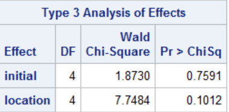
```


Conducting a joint test to assess whether initial level of motivation has an effect on response

$H_0:$ initial level of motivation has no effect on response

Wald $\chi^2=1.873$ with df=4 p-value$=.759>.05$ Thus fail to reject $H_0$

Conclude initial level of motivation does not a have statistically significant effect on response


## part c

Using this model, provide an estimate and 95% confidence interval for the odds ratio of
high vs. medium response comparing ‘low’ initial level of motivation with those having
‘none’; repeat for ‘average’ vs. ‘none’.

i. Repeat for low vs. medium response, as well as for high vs. low response.

ii. What do you conclude about the statistical significance of each effect
from these confidence intervals?


```{r out.width="45%",echo=F}
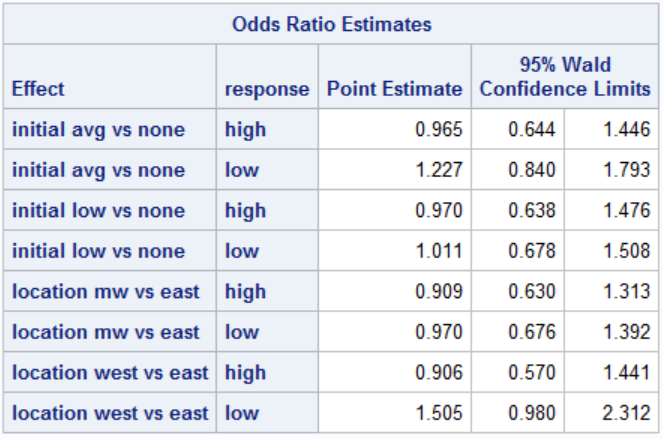
```

Odds ratio of high vs medium response comparing low initial motivation to none

$OR= .97$ 95% CI: $(.638,1.476)$

Odds ratio of high vs medium response comparing average initial motivation to none

$OR= .965$ 95% CI: $(.644,1.446)$

Odds ratio of low vs medium response comparing low initial motivation to none

$OR= 1.011$ 95% CI: $(.678,1.508)$

Odds ratio of low vs medium response comparing average initial motivation to none

$OR= 1.227$ 95% CI: $(.84,1.793)$

```{r out.width="40%",echo=F}
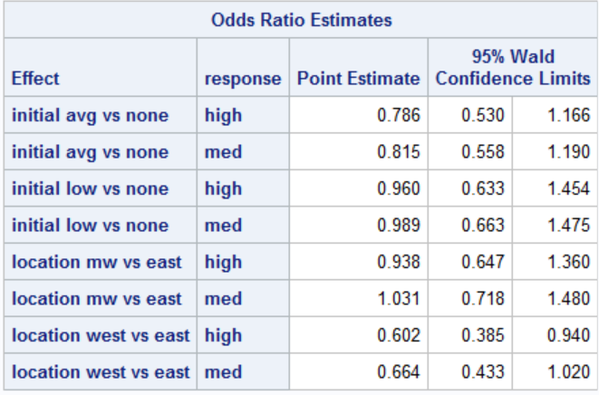
```

Odds ratio of hig vs low response comparing low initial motivation to none

$OR= .960$ 95% CI: $(.633,1.454)$

Odds ratio of high vs low response comparing average initial motivation to none

$OR= .786$ 95% CI: $(.53,1.166)$


Since all of the confidence intervals include the null value 1, conclude each effect is not statistically significant. This implies that initial motivation doe not have a significant on response. This is in agreement with our results from part b.


# Problem 3

## part a

i. Using logistic regression, describe the relationship between favorable response (vs.
unfavorable response) and ln(dose) as a continuous explanatory variable:
State the assumptions and mathematically specify the model. Evaluate
goodness of fit for this model.

__Assumptions:__

Assume responses of subjects determined through tolerance distribution

Assumelogistic distribution for tolerances

```{r out.width="35%",echo=F}
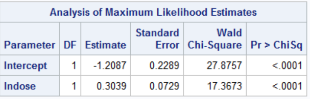
```

$logit\left(\frac{p_i}{1-p_i}\right)=\alpha+\beta \ln(dose)$

$logit\left(\frac{p_i}{1-p_i}\right)=-1.209+.304\ln(dose)$

$\ln(dose)$ is the natural log of the dose (a continuous variable)

```{r out.width="35%",echo=F}
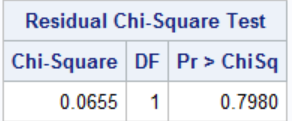
```

Conducting a residual $\chi^2$ test for goodness of fit.

$H_0:$ The model fit is adequate

Residual Score statistic $\chi^2=.0655$ df=1 pvalue=.798>.05

Fail to reject the null hypothesis, conclude the model fit is adequate

ii. Provide estimates and 95% Fiducial Limits (CI) for the dose values
corresponding to ED25, ED50, and ED75. In other words, provide estimates
and 95% confidence limits for the dose values which produce a response with
0.25, 0.50, and 0.75 probabilities, respectively.

```{r out.width="35%",echo=F}
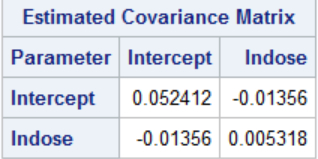
```
```{r}
a=-1.2087
b=.3039
va=.052412
vb=.005318
vab=-.01356
```


```{r}
x25=(-1.0986-a)/b
vx25=x25^2*(va/(-1.1-a)^2+vb/b^2+2*vab/((-1.1-a)*b))
c(x25-1.96*sqrt(vx25),x25+1.96*sqrt(vx25))
```


$x_{25}=\log(ED25)$

$\hat{x_{25}}=(-1.0986-\hat{\alpha})/\hat{\beta}=.362$

$ED25=\exp(\hat{x_{25}})=1.437$

95% CI: $\exp(-.998,1.723)=(.368,5.602)$


```{r}
x50=3.977
ex50=exp(3.977295)
v=(va/a^2-2*(vab)/(a*b)+vb/b^2)
vx50=(3.977295)^2*v
c(x50-1.96*sqrt(vx50),x50+1.96*sqrt(vx50))
```

$x_{50}=\log(ED50)$

$\hat{x_{50}}=-\hat{\alpha}/\hat{\beta}=1.209/.304=3.977$

$ED50=\exp(3.977)=53.357$

$var(\hat{x_{50}})=.3104$

95% CI: $\exp(3.977\pm 1.96\sqrt{.3104})=\exp((2.885,5.069))=(17.902,159.03)$

```{r}
x75=(1.0986-a)/b
vx75=x75^2*(va/(1.1-a)^2+vb/b^2+2*vab/((1.1-a)*b))
c(x75-1.96*sqrt(vx75),x75+1.96*sqrt(vx75))
```


$x_{75}=\log(ED75)$

$\hat{x_{75}}=(1.0986-\hat{\alpha})/\hat{\beta}=7.592$

$ED75=\exp(\hat{x_{75}})=1982.869$

95% CI: $\exp(5.069,10.116)=(158.954,24735.284)$


iii. Use a probit analysis to calculate all the estimates and confidence intervals
requested in Part 3.a.i. How do your assumptions change when using a probit
model vs a logistic model?

```{r out.width="35%",echo=F}
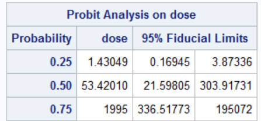
```

When using a logistic mdoel you assume an underlying logistic tolerance distribution, when using a probit model you assume either a logistic tolerance distribution or an underlying normal tolerance distribution

iv. Briefly compare and contrast your results from Problems 3a.i and ii.
For both treatments

The two parts yielded roughly the same point estimates but very different confidence intervals. The confidence intervals calculated by SAS were much wider than the ones calculated by hand.

## part b

```{r out.width="40%",echo=F}
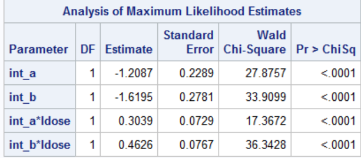
```


Using logistic regression to describe the relationship between favorable response and
ln(dose) as a continuous explanatory variable for the data, and allowing for separate
effects for each treatment group, as illustrated in class:

i. State the assumptions and mathematically specify the model.

__Assumptions__:

The responses of subjects determined through a tolerance distribution and the tolerances follow a logistic distribution

The observations are independent

The data arose from a simple random sample

The model fits the data adequately

dilution assumption: $x_a=\log(\rho) x_b$

where $x_a$ and $x_b$ are log doses of drugs a and b and $\rho$ is the relative potency

logistic model for drug A:

$\log{(p_a(x_ai))/(1-p_a (x_ai))}=\alpha_a+\beta x_ai$


where $x_ai$ is the log dose levels of drug A.  

$\log{(p_b(x_bi))/(1-p_b(x_bi))}= \alpha_b+\beta x_bi$

where $x_bi$ is the log dose levels of drug B

ii. Evaluate goodness of fit of the model.

```{r out.width="40%",echo=F}
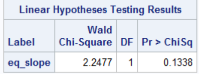
```


$\chi^2$=2.248 with df=1 p-value=.134

Since the p-value is significantly large, we do not reject the null hypothesis of a common slope.

The linear hypothesis test of equal slopes supports the conclusion that a parallel lines model fits the data

iii. Provide a point estimate and its 95% confidence interval for the relative potency of Treatment B relative to Treatment A.

$\rho$ is the relative potency of Treatment B relative to Treatment A.

$\rho=\exp((\hat{\alpha_b}-\hat{\alpha_a})/\hat{\beta})$

$\rho=1.121$ 95% CI: $(.42,3.311)$

```{r out.width="40%",echo=F}
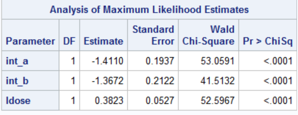
```


# Problem 4

## part a

Specify the mathematical structure of a statistical model to describe the variation in the
rates of the disorder per 100,000 live births with respect to maternal age group and birth
order.

Poisson Regression Model:

$\log(\mu(x)/[N(x)/100000])=x^{\prime}\beta=\beta_0+\beta_1 I(age25-29)+\beta_2 I(age30-34)+\beta_3 I(35-39)+\beta_4 I(age40+)+\beta_5I(order2)+\beta_6I(order3)$

$\lambda(x)=\log(\mu(x)/[N(x)/100000])$ is rate for incidence per 100,000 people

$\mu(x)$ is the expected value of the number of cases of birth disorder

$x$ is the vector of the age and order explanatory variables

$N(X)$ is the total number of births

$\beta$ is the vector of parameter values

The offset is $\log(N(x))-\log(100000)$

## part b

Interpret the estimated parameters of this model, and provide appropriate two-sided 95%
confidence intervals for those pertaining to birth order.

```{r out.width="40%",echo=F}
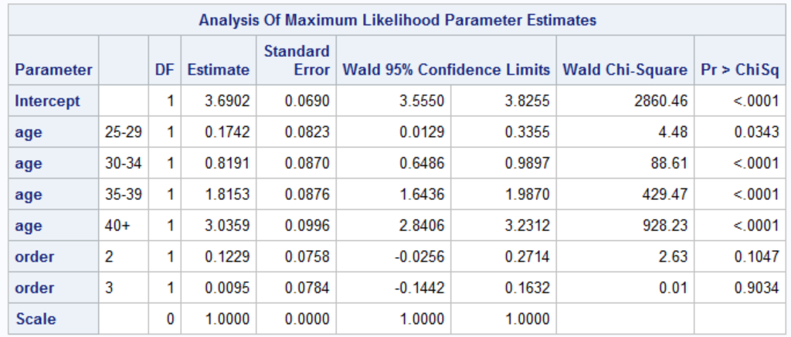
```

The intercept is the log incidence density per 100,000 people for the 20-24 age group and first birth order.

The age parameter estimates are the incremental effect for the log incidence density per 100,000 people as you go up in age group

The order parameter estimates is the incremental effect for the log incidence density per 100,000 people as you increase in birth order (ie first to second to third)


order2 estimate $\hat{\beta_5}=.123$ 95% CI: $(-.026,.271)$

order3 estimate $\hat{\beta_6}=.01$ 95% CI:$(-.144,.163)$ 


## part c

Use the model from Problem 4.a. to obtain predicted values for the rates of the birth
disorder for the respective birth order subpopulations corresponding to ‘30-34 years’ for
maternal age group.

incidence rate per 100,000 people of the birth disorder for the subpopulation corresponding to 30-34 years and birth order 1

$\exp(\beta_0+\beta_2)=\exp(3.6902+.8191)=90.858$

incidence rate per 100,000 people  of the birth disorder for the subpopulation corresponding to 30-34 years and birth order 2

$\exp(\beta_0+\beta_2+\beta_5)=\exp(3.6902+.8191+.1229)=102.74$

incidence rate per 100,000 people  of the birth disorder for the subpopulation corresponding to 30-34 years and birth order 3

$\exp(\beta_0+\beta_2+\beta_6)=\exp(3.6902+.8191+.0095)=91.725$

