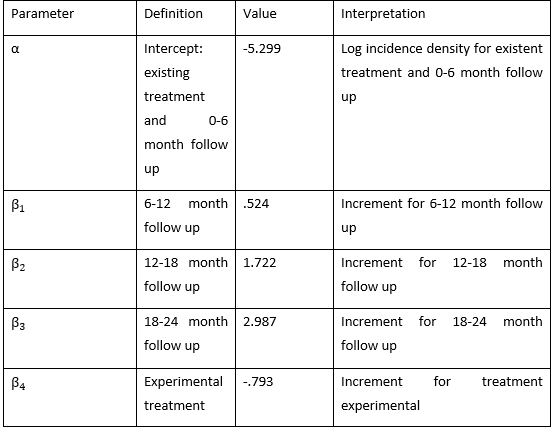

```{r setup, include=FALSE}
knitr::opts_chunk$set(echo = TRUE,message=F,warning=F)
```


```{r,echo=F}
library(knitr)
library(survival)
library(tidyverse)
```

# Problem 1

```{r}
interval=c(0,1,2,3)
cex=c(3,5,14,35)
wdex=c(3,2,7,12)
atex=c(118,112,105,84)
noex=atex-cex-wdex
```

```{r}
cep=c(2,3,9,17)
wdep=c(2,1,9,17)
atep=c(118,114,110,92)
noep=atep-cep-wdep
treatv=c(rep("exper",4),rep("exist",4))
q1=tibble("treat"=treatv,"interval"=rep(interval,2),"nocaries"=c(noep,noex),"caries"=c(cep,cex),"withdraw"=c(wdep,wdex),"atrisk"=c(atep,atex))
exper=q1%>%filter(treat=="exper")%>%select(-treat)
exist=q1%>%filter(treat=="exist")%>%select(-treat)
```

```{r echo=F}
time=c(rep(1,3),rep(1,3),rep(2,2),rep(2,5),rep(3,7),rep(3,14),rep(4,12),rep(4,35),rep(4,37))
status=c(rep(0,3),rep(1,3),rep(0,2),rep(1,5),rep(0,7),rep(1,14),rep(0,12),rep(1,35),rep(0,37))
fitex=survfit(Surv(time,status)~1)
#summary(fitex)
```

```{r echo=F}
t2=     c(rep(1,2),rep(1,2),rep(2,1),rep(2,3),rep(3,9),rep(3,9),rep(4,17),rep(4,17),rep(4,58))
status2=c(rep(0,2),rep(1,2),rep(0,1),rep(1,3),rep(0,9),rep(1,9),rep(0,17),rep(1,17),rep(0,58))
fitex2=survfit(Surv(t2,status2)~1)
#summary(fitex2)
```


## part a

Construct the life table format for the data separately for each treatment group.

__interval__: 0-6=0, 6-12=1, 12-18=2, 18-24=3 

```{r echo=F}
kable(exist,caption="existing")
```

```{r echo=F}
kable(exper,caption="experimental")
```

## part b

Provide life table estimates for the cumulative probabilities (and corresponding
standard errors) for no occurrence of dental caries by the end of each of the four periods
for each treatment group. State the assumptions for these estimates, and assume
withdrawals may be treated as not having dental caries at the time of withdrawal.

__Assumptions__:

- The first observation for each interval/stratification level includes subjects who
withdrew and the second level will include subjects who have the event

- Patients who experienced dental caries are not censored

- Withdrawal is independent of condition being studied

- Multiple withdrawals occur uniformly throughout the interval

```{r out.width="60%",echo=F}
include_graphics("ltexist.png")
```


```{r out.width="60%",echo=F}

```

```{r echo=F}
probex=tibble(Interval=c("0-6","6-12","12-18","18-24"),"Survival Probability"=c(.974,.93,.802,.442),"Standard Error"=c(.015,.024,.038,.05))
kable(probex,caption="Existing")
```

```{r echo=F}
probexp=tibble(Interval=c("0-6","6-12","12-18","18-24"),"Survival Probability"=c(.983,.957,.875,.697),"Standard Error"=c(.012,.019,.031,.046))
kable(probexp,caption="Experimental")
```


# Problem 2

## part a

Mathematically specify the structure of the model that includes main effects for treatment
and time, as well as their interaction. Mathematically define all variables used in the model

```{r}
nonex=c(112,105,84,37)
failex=c(3,5,14,35)
wdex=c(3,2,7,12)
ptex=6*(nonex+.5*failex+.5*wdex)
ptex
```

```{r}
nonep=c(114,110,92,58)
failep=c(2,3,9,17)
wdep=c(2,1,9,17)
ptep=6*(nonep+.5*failep+.5*wdep)
ptep
```

```{r out.width="40%",echo=F}

```

```{r out.width="40%",echo=F}

```

__Assumptions__:

- Withdrawals are uniformly distributed during time
intervals in which they occur and are unrelated to
treatment failures

- Within-interval probabilities of treatment failures are small. Time-to-failure events have independent exponential distributions

$logit(\lambda/n)=\alpha+\beta_1 X_1+\beta_2 X_2+\beta_3 X_3+\beta_4 X_4+\beta_5 X_5+\beta_6 X_6+\beta_7 X_7$

where $\lambda$ is the number of caries and n is the person-months of exposure

```{r out.width="40%",echo=F}

```

```{r out.width="40%",echo=F}

```


## part b

Fit the model you specified in (a) and assess the effect of interaction between treatment
and time.

```{r out.width="40%",echo=F}

```

$H_0: \beta_5=\beta_6=\beta_7$ The interaction between treatment and time is nonsignificant

Wald $\chi^2=1.15$ df=3 p-value$=.765>.05$ Fail to reject $H_0$ and conclude that the interaction between treatment and time is not significant.

## part c

Regardless of your conclusion from part (b), fit the main effects model (i.e., the model
without interaction terms) for treatment and follow-up period.

### i) 

Interpret the model parameters.

$logit(\lambda/n)=\alpha+\beta_1 X_1+\beta_2 X_2+\beta_3 X_3+\beta_4 X_4$

```{r out.width="40%",echo=F}

```

```{r out.width="40%",echo=F}

```

### ii)

Provide a 95% confidence interval for the model parameter corresponding to the
treatment variable.

```{r}
c(-.7917-1.96*.2283,-.7917+1.96*.2283)
```


$\hat{\beta_4}=-.793$ $se=.2283$

95% CI: $(-1.239,-.344)$


## part d

For each treatment group, provide model-predicted values using the model in part (c) for
cumulative probabilities of no occurrence of dental caries by 6 months, 12 months, 18
months, and 24 months, respectively.

__Cumulative probabilities of no occurrence of a cavity__

| Time,Treat      | Failure rate formula         | Failure within interval failure | Estimated Survival      |
|-----------------|------------------------------|---------------------------------|-------------------------|
| 6 mo Exist      | $e^{\alpha}$                 | $e^{-5.299}=.005$               | $1*e^{-.005*6}=.970$    |
| 12 mo Exist     | $e^{\alpha+\beta_1}$         | $e^{-5.299+.524}=.008$          | $.974*e^{-.008*6}=.928$ |
| 18 mo Exist     | $e^{\alpha+\beta_2}$         | $e^{-5.299+1.722}=.028$         | $.957*e^{-.028*6}=.809$  |
| 24 mo Exist     | $e^{\alpha+\beta_3}$         | $e^{-5.299+2.987}=.099$         | $.875*e^{-.099*6}=.483$  |
| 6 mo Exper      | $e^{\alpha+\beta_4}$         | $e^{-5.299+-.793}=.002$         | $1*e^{-.002*6}=.988$    |
| 12 mo Exper     | $e^{\alpha+\beta_4+\beta_1}$ | $e^{-5.299+-.793+.524}=.004$    | $.983*e^{-.004*6}=.957$ |
| 18 mo Exper     | $e^{\alpha+\beta_4+\beta_2}$ | $e^{-5.299+-.793+1.722}=.013$   | $.957*e^{-.013*6}=.885$ |
| 24 mo Exper     | $e^{\alpha+\beta_4+\beta_3}$ | $e^{-5.299+-.793+2.987}=.045$   | $.875*e^{-.045*6}=.668$ |

# Problem 3

## part a

Fit a GEE repeated measures logistic regression model across all study follow-up visits (not
including at the time of randomization) to describe the marginal relationship of participants’
self-rating of good health to the main effects of randomized group, visit (as a class variable),
health self-rating at time of randomization, and age group as explanatory variables together
with group by visit interaction. Use 15-24 year old women in the control group with a good
health assessment at randomization as your reference group, and use 3 months post-
randomization as your reference visit. Specify an exchangeable working correlation structure.

$y_{ij}$ denotes the response from subject i at time j

Assuming an exhangeable working correlation structure:

$R_{i}(\alpha)$ is the working correlation matrix, which may depend on a vector of unknown parameters $\alpha$ which is the same for all subjects.

$$Corr(Y_{ij},Y_{ij'})=\begin{cases} 1 \quad j=j'\\
\alpha \quad j\neq j' \end{cases}$$

### i)

Assess goodness of fit through consideration of other pairwise interactions between
explanatory variables in the model. Also assess whether group by visit needs to remain
in the model.

```{r out.width="40%",echo=F}

```

Assessing goodness of fit through consideration of other pairwise interactions between explanatory variables

Model= drug time base agegroup $drug*$time $drug*$base $drug*$agegroup $time*$base $time*$agegroup base$*$agegroup

The Score statistics for Type 3 GEE Analysis Tests show that none of the interaction terms are significant

$\alpha=.05$

time*drug

$\chi^2_2=1.59$ p-value $=.452>\alpha$ Reject $H_0$ $time*drug$ interaction term is not significant

base*drug

$\chi^2_1=2.36$ p-value $=.124>\alpha$ Reject $H_0$ $base*drug$ interaction term is not significant

age_group*drug

$\chi^2_2=4.05$ p-value $=.132>\alpha$ Reject $H_0$ $agegroup*drug$ interaction term is not significant

time*base

$\chi^2_2=.05$ p-value $=.977>\alpha$ Reject $H_0$ $time*base$ interaction term is not significant

$time*agegroup$ $\chi^2_4=6.64$ p-value $=.156>\alpha$ Reject $H_0$ $time*agegroup$ interaction term is not significant

$base*agegroup$ $\chi^2_2=2.91$ p-value $=.233>\alpha$ Reject $H_0$ $base*agegroup$ interaction term is not significant

Conclusion: no significant interaction terms

Assessing whether time*agegroup interaction should be in the model

Model=drug time base agegroup time*agegroup

```{r out.width="40%",echo=F}

```

Score statistics for Type 3 GEE Analysis Test

time*agegroup

$\chi^2_4=6.68$ p-value $=.154>\alpha$ Reject $H_0$ time*agegroup interaction term is not significant

Based on this result we will not include time*agegroup in the model


Our final model is:

model = drug time base agegroup

```{r out.width="40%",echo=F}

```


### ii)

Do the results of i) affect your choice for the final model? Explain in 1-2 sentences.

The interaction terms were non significant thus we have no interaction terms in our final model. Therefore the results from the first part affect the choice for the final model.

### iii)

For the final model based on ii), present the table of parameter estimates, along with a
standard error, test statistic, and p-value for each.

```{r out.width="40%",echo=F}

```

reference group: agegroup=15-24, drug=1 (placebo), time=2, base=good


## part b

Using your final recommended model from part (a), separately for each follow up visit, provide
the odds ratio and corresponding 95% confidence interval that pertains to the intervention
effect as estimated by the model for that visit.

$\alpha$=intercept

$\beta_1$ = treatment drug

$\beta_2$ = time 3

$\beta_3$ = time 4


Odds Ratio comparing treatment effect for time 2

$\exp(\alpha_1+\beta_1)/\exp(\alpha_1)=\exp(\beta_1)=\exp(1.949)=7.022$

Odds Ratio comparing treatment effect for time 3

$\exp(\alpha_1+\beta_1+\beta_2)/\exp(\alpha_1+\beta_2)=\exp(\beta_1)=\exp(1.949)=7.022$

Odds Ratio comparing treatment effect for time 4

$\exp(\alpha_1+\beta_1+\beta_3)/\exp(\alpha_1+\beta_3)=\exp(\beta_1)=\exp(1.949)=7.022$

The odds ratio is the same at each time. OR= $7.022$ 95% CI = $(\exp(1.036),\exp(2.863))=(2.818,17.512)$

At each visit, the odds of self-rating of good health compared to poor for the treatment group is approximately 7 times that of the control group. The interval does not include the null value of 1 thus the results are statistically significant. 

## part c

Briefly summarize your findings related to the intervention effect(s) (adjusted for baseline
status and age group, and addressing time in a way that is consistent with your final model) in
2-3 sentences.

```{r out.width="40%",echo=F}

```

Looking at the score statistics for type 3 GEE analysis, the p-value for the treatment drug is highly significant. Based on this result and the odds ratio results from part b, the model indicates that the treatment does have an effect on self-rating of good health, adjusted for baseline status and age group.

