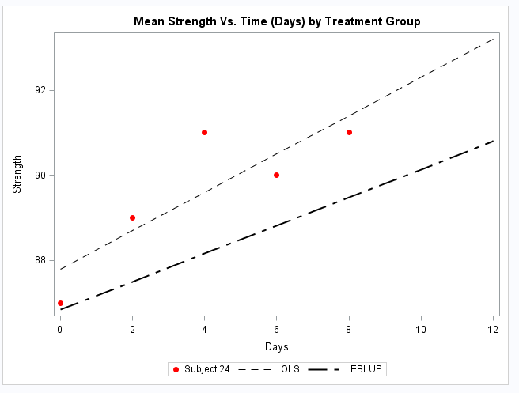

###8.1.0: Generate a "spaghetti plot" (e.g. Figure 3.4 in the textbook). Use solid lines for Program 1 and dashed lines for Program 2 (You can reduce over plotting by adding a random uniform(-0.5,0.5) to each response value). Further, present simple descriptive statistics.

```{r,eval=TRUE,echo=FALSE, warning=FALSE}
library(ggplot2)
data_long<-read.csv(file='exercise_new.csv')
data_long$line<-ifelse(data_long$program==1,'Program 1','Program 2')
p <- ggplot(data = data_long, aes(x = visit, y = y, group = id))
p + geom_line(aes(linetype=line)) + labs(title = "Spaghetti Plot of Exercise Strength", x= "Visit", y="Strength")
```


Simple Descriptive Statistics:

Means Table for Program 1: 

|Visit   | N  | N Miss | Mean  | SD | Median | Min | Max  |
|--------|----|--------|-------|----|--------|-----|------|
|1       | 16 | 0      | 79.69 |3.11|79.50   |74.00| 84.00|
|2       | 15 | 1      | 80.67 |3.31|81.00   |75.00| 85.00|
|3       | 16 | 0      | 80.81 |3.58|80.00   |76.00| 87.00|
|4       | 15 | 1      | 81.33 |3.68|82.00   |76.00| 89.00|
|5       | 15 | 1      | 80.80 |3.84|81.00   |75.00| 86.00|
|6       | 13 | 3      | 81.08 |4.03|82.00   |75.00| 87.00|
|7       | 15 | 1      | 81.07 |4.32|81.00   |75.00| 87.00|


Means Table for Program 2:

|Visit   | N  | N Miss | Mean  | SD | Median | Min | Max  |
|--------|----|--------|-------|----|--------|-----|------|
|1       | 21 | 0      | 81.05 |3.11|81.00   |74.00| 87.00|
|2       | 21 | 0      | 81.67 |3.35|81.00   |75.00| 89.00|
|3       | 20 | 1      | 81.90 |3.57|81.50   |75.00| 91.00|
|4       | 21 | 0      | 82.62 |2.85|82.00   |78.00| 90.00|
|5       | 19 | 2      | 82.74 |3.46|83.00   |75.00| 91.00|
|6       | 17 | 4      | 82.35 |2.71|83.00   |76.00| 87.00|
|7       | 15 | 6      | 82.53 |2.90|83.00   |76.00| 86.00|


Means Table for Program 1 and Program 2:

|Visit   | N  | N Miss | Mean  | SD | Median | Min | Max  |
|--------|----|--------|-------|----|--------|-----|------|
|1       | 37 | 0      | 80.46 |3.14|80.00   |74.00| 87.00|
|2       | 36 | 1      | 81.25 |3.32|81.00   |75.00| 89.00|
|3       | 36 | 1      | 81.42 |3.56|81.00   |75.00| 91.00|
|4       | 36 | 1      | 83.08 |3.24|82.00   |76.00| 90.00|
|5       | 34 | 3      | 81.88 |3.71|82.00   |75.00| 91.00|
|6       | 30 | 7      | 81.80 |3.35|82.50   |75.00| 87.00|
|7       | 30 | 7      | 81.80 |3.69|82.00   |75.00| 87.00|


|Visit  | Program 1 | Program 2| Total |
|-------|-----------|----------|-------|
| 1     | 16        | 21       | 37    |
| 2     | 15        | 21       | 36    |
| 3     | 16        | 20       | 36    |
| 4     | 15        | 21       | 36    |
| 5     | 15        | 19       | 34    |
| 6     | 13        | 17       | 30    |
| 7     | 15        | 15       | 30    |
| All   | 105       | 134      | 209   |


###8.1.1: On a single graph, construct a time plot that displays the mean strength verses time (in days) for the two groups. Describe the general characteristics of the time trends for the two exercise programs.

```{r,eval=TRUE,echo=FALSE}
exercise <- read.table("exercise.dat", header=TRUE)
visit <-rep( c("y1", "y2", "y3", "y4", "y5", "y6", "y7"), 2)
trt <- c(rep("Treatment_1",7),rep("Treatment_2", 7))

trt1 <- exercise[exercise$program==1,]
trt2 <- exercise[exercise$program==2,]

means<-c(mean(trt1$y1), mean(trt1$y2, na.rm =TRUE), mean(trt1$y3, na.rm=TRUE), mean(trt1$y4, na.rm=TRUE), mean(trt1$y5,na.rm=TRUE), mean(trt1$y6,na.rm=TRUE), mean(trt1$y7,na.rm=TRUE), mean(trt2$y1), mean(trt2$y2, na.rm =TRUE), mean(trt2$y3, na.rm=TRUE), mean(trt2$y4, na.rm=TRUE), mean(trt2$y5,na.rm=TRUE), mean(trt2$y6,na.rm=TRUE), mean(trt2$y7,na.rm=TRUE))

temp <- as.data.frame(cbind(visit, as.numeric(means), trt))

p <- ggplot(data=temp, aes(x=visit, y=means, group=trt)) + geom_line(aes(color=trt))+
  geom_point(aes(color=trt)) + labs(title = "Mean Measure of Strength by  Visit for each Treatment", x= "Visit", y="Mean Strength", color="Program") 

p

```


By looking at the graph we see that the mean strength tends to increase over time for both treatment groups. Treatment 1 decreases between visit 4 and visit 5, and for treatment 2, the mean strength decreases between visit 5 and visit 6.

###8.1.3: Fit a model with randomly varying intercepts and slopes, and allow the mean values of the intercept and slope to depend on treatment group. 

###8.1.3A: What is the estimated variance of the random intercepts?

9.9530

###8.1.3B: What is the estimated variance of the random slopes?

0.03433

###8.1.3C: What is the estimated correlation between the random intercepts and slopes?

-0.01685

###8.1.3D: Give an interpretation to the magnitude of the estimated variance of the random intercepts. 

There is a large variability in the baseline strength. Approximately 95% of the subjects have a baseline strength between 73.949 and 86.316. 

###8.1.3E: Give an interpretation to the magnitude of the estimated variance of the random slopes

Approximately 95% of the subjects have a change in strength between -0.246 and 0.480.


###8.1.4: Is a model with only randomly varying intercepts defensible? Explain?

LRT where the critical value is a 50:50 mixture of chi-square distributions with 1 and 2 degrees of freedom which implies that the critical values is 5.14. 

For the model with two random effects,  -2 log L = 818.5

For model with one random effect,  -2 log L=883.16

 $\chi^2_{obs}=64.66 > 5.14$  
 
Conclusion: There is significant evidence that the model with random slopes and random intercept is a better fit than the model with random intercepts only. 

###8.1.5: What are the mean intercept and slope in the two exercise programs? 

Answer:

|Program   | Intercept| Slope |
|----------|----------|-------|
| 1        | 80.13    | 0.12  |
| 2        | 81.26    | 0.17  |


###8.1.6: Based on the previous analysis, interpret the effect of treatment on changes in strength. Does your analysis suggest a difference between the two groups?

By looking at the previous analysis we see that the slope is 0.12 for program 1 and 0.17 for program 2. This implies that for program 2 increases mean strength at higher rate than program 1. The estimated slope for program 2 is 0.05 units higher than for program 1, but the standard error of this estimate is 0.07 which implies that since program 2 and program 1 slope overlap there is not a significant difference in the effect of treatment on changes in strength.

###8.1.7: What is the estimate of $Var(Y_{i1}|b_i)$? What is the estimate of $Var(Y_{i1})$? Explain the difference.

$Var(Y_{i1}|b_i)=\sigma^2_w=0.6647$

$Var(Y_{i1})=\sigma^2_w+\sigma^2_b=9.9530+0.6647=10.618$

The difference between the variance estimates is whether the estimate accounts for the between subject variance. We see specifically that the between subject variance is a lot higher than the within subject variance.

###8.1.8: Obtain the predicted (empirical BLUP) intercept and slope for each subject.

|ID       | Intercept| Days     |
|---------|----------|----------|
| 1       | -1.05    |-0.07722  |
| 2       |2.901     |0.2284    |
| 3       |1.6416    |-0.03429  |
| 4       |0.8565    |-0.02125  |
| 5       |-0.00089  |0.2643    |
| 6       |-3.9973   |-0.1568   |
| 7       |1.9631    |0.1496    |
| 8       |-2.6083   |0.2282    |
| 9       |5.1254    |0.06494   |
| 10      |-4.7068   |0.1766    |
| 11      |-3.3905   |-0.1399   | 
| 12      |4.0293    |0.06389   |
| 13      |-1.1989   |0.1102    |
| 14      |-2.3859   |-0.32     |
| 15      |-1.5834   |-0.4037   |
| 16      |4.3992    |-0.133    |
| 17      |2.6896    |-0.2129   |
| 18      |-6.4033   |-0.04026  |
| 19      |1.4074    |-0.1891   |
| 20      |5.1665    |-0.1298   |
| 21      |1.2341    |0.1031    |
| 22      |-2.1102   |-0.1197   |
| 23      |-2.6095   |0.1725    |
| 24      |6.7042    |0.2163    |
| 25      |-0.5468   |0.02191   |
| 26      |0.7133    |0.1795    |
| 27      |-2.1713   |0.05064   |
| 28      |-1.783    |0.2164    |
| 29      |2.2534    |-0.1455   |
| 30      |-0.2077   |0.08385   |
| 31      |-3.1237   |-0.09204  |
| 32      |1.0626    |-0.03455  |
| 33      |-1.7869   |-0.09655  |
| 34      |-0.1224   |-0.1446   |
| 35      |4.2922    |-0.1017   |
| 36      |-3.3265   |0.2276    |
|37       |-1.3319   |0.03495   |

###8.1.9: Using any standard linear regression procedure, obtain the ordinary least squares (OLS) estimates of the intercept and slope from the regression of strength on time (in days) for subject 24.

For subject 24 and using OLS we find the intercept is 87.80  and the slope is 0.45. 

###8.1.10: For subject (ID=24), compare the predicted intercepts and slopes obtained in Problems 8.1.8 and 8.1.9. How and why might these differ?For subject 24, and on one graph, plot the subject's data points, the "population mean" line, the subject-specific predicted line (based on the EBLUPs) and the OLS line obtained in 8.1.9. What features of the graph are to be expected?

For subject 24, the empirical blup slope is 0.33 and the intercept is 86.84. We expect the OLS estimates to be slightly higher than the EBLUPS because the empirical BLUPS are predicted and the OLS estimates are estimated, as well as that for subject 24, there is only 5 of the 7 observations available which causes a reduction in the subjects predicted response. 





###Extra: Based on the model in 8.1.3, obtain estimates of the ICC at baseline and on day 12 for each program (i.e. 4 ICC's).

G=$(\begin{array}
{rrr}
9.953  & -0.029 \\
-0.029 & 0.0343
\end{array})$

$\sigma^2_w=0.665$

$\sigma^2_{bi}=g_{11}+t^2_i*g_{22}+2*t_i*g_{12}$

ICC at time i = $\frac{\sigma^2_{bi}}{\sigma^2_{bi}+\sigma^2_{w}}$

|Program    | Baseline ICC    | Day 12 ICC |
|-----------|-----------------|------------|
| 1         | 0.94            | 0.96       |
| 2         | 0.94            | 0.96       |


```{r, eval=FALSE,echo=FALSE}
g11<- 9.953
g12<- -0.029
g22<- 0.0343

t<-c(0,2,4,6,8,10,12)

sigmab<-g11+g22*t^2 + 2*t*g12

sigmaw<-0.665

ICC<-sigmab/(sigmab+sigmaw)
```

