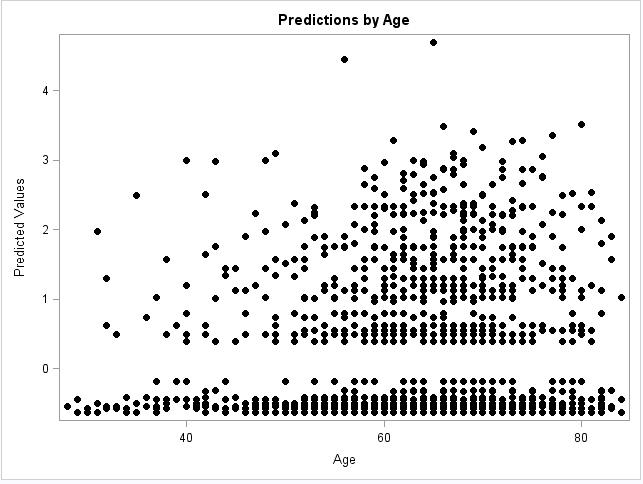
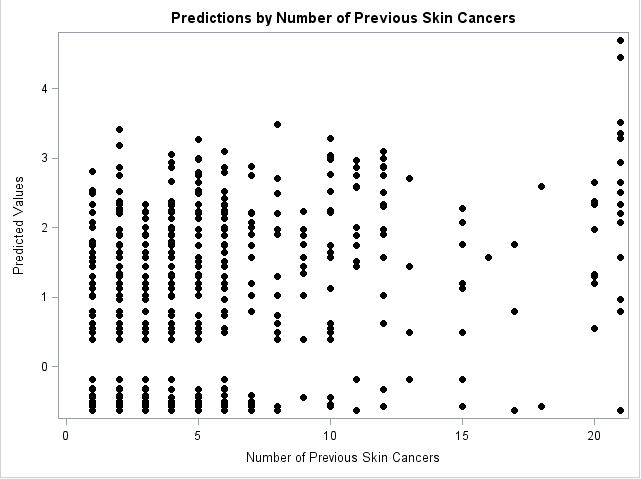

For more background about the study, see the relevant papers are in the papers folder. Note that "Exposure" is a subject-level variable. It is not updated year to year as the word "previous" might suggest.

###14.2.0: Given the study design and objectives, present some descriptive statistics, including the distribution of the number of observations per subject.

According to our question the main objective of the analyses is to compare the effects of beta carotene on skin cancer rates.The outcome variable is a count of the number of new skin cancers per year.

|          | Placebo | Beta Carotene| Total |
|----------|---------|--------------|-------|
| Center 1 | 971     | 912          |1883   |
| Center 2 | 612     | 636          |1248   |
| Center 3 | 535     | 563          |1098   |
| Center 4 | 1406    | 1446         | 2852  |
| Total    | 3524    | 3557         | 7081  |

|          | Female  | Male     | Total |
|----------|---------|----------|-------|
| Center 1 | 743     | 1140     |1883   |
| Center 2 | 321     | 927      |1248   |
| Center 3 | 211     | 887      |1098   |
| Center 4 | 988     | 1864     |2852   |
| Total    | 2263    | 4818     | 7081  |


|          |Year 1|Year 2|Year 3|Year 4| Year 5| Total |
|----------|------|------|------|------|-------|-------|
| Center 1 | 422  | 413  | 397  | 377  | 274   |1883   |
| Center 2 | 315  | 298  |276   | 236  | 123   | 1248  |
| Center 3 | 253  | 243  | 236  | 229  | 137   | 1098  |
| Center 4 | 693  | 676  | 661  | 545  | 277   | 2852  |
| Total    | 1683 |1630  | 1570 | 1387 | 811   | 7081  |


|              |Year 1|Year 2|Year 3|Year 4| Year 5| Total |
|--------------|------|------|------|------|-------|-------|
| Placebo      | 827  | 803  | 776  | 699  | 419   | 3524  |
| Beta Carotene| 856  | 827  | 794  | 688  | 392   | 3557  |
| Total        | 1683 |1630  | 1570 | 1387 | 811   | 7081  |


|              |No Burn| Skin | Total |
|--------------|-------|------|-------|
| Placebo      | 1961  | 1563 | 3524  |
| Beta Carotene|1932   | 1625 |3557   |
| Total        | 3893  |3188  | 7081  |


**Mean Tables For Exposure (count of the number of previous skin cancers)**

|skin| N  | Mean| SD  | Minimum|Maximum |
|----|----|-----|-----|--------|--------|
|0   |3893| 2.45| 2.89| 1.00   |21.00   |
|1   |3188| 3.33| 3.81| 1.00   |21.00   |

|treatment| N  | Mean| SD  | Minimum| Maximum| 
|---------|----|-----|-----|--------|--------|
|0        |3524| 2.78| 3.31| 1.00   |21.00   | 
|1        |3557| 2.92| 3.40| 1.00   |21.00   | 

|gender   | N  |Mean |SD   | Minimum| Maximum| 
|---------|----|-----|-----|--------|--------|
|0        |2263|2.42 |2.64 |1.00    |21.00   |
|1        |4818|3.05 |3.63 |1.00    |21.00   |

|center   |N   |Mean |SD   | Minimum| Maximum| 
|---------|----|-----|-----|--------|--------|
|1        |1883|2.60 |3.03 | 1.00   |21.00   |
|2        |1248|4.24 |4.56 | 1.00   |21.00   |
|3        |1098|3.40 |3.94 | 1.00   |21.00   |
|4        |2852|2.19 |2.34 | 1.00   |21.00   |


**Mean Tables For Age**

|skin | N   |Mean  |SD    | Minimum| Maximum|
|-----|-----|------|------|--------|--------|
|0    |3893 |62.88 |9.93  |28.00   | 84.00  | 
|1    |3188 |63.14 |9.82  |29.00   | 84.00  |

|treatment| N   |Mean  |SD    | Minimum| Maximum| 
|---------|-----|------|------|--------|--------|
|0        |3524 |63.05 |9.72  | 30.00  |83.00   |
|1        |3557 |62.94 |10.04 | 28.00  |84.00   | 

|gender   | N   |Mean  |SD    | Minimum| Maximum| 
|---------|-----|------|------|--------|--------|
|0        |2263 |63.39 |9.33  | 32.00  |83.00   |
|1        |4818 |62.82 |10.13 | 28.00  |84.00   | 

|center   |N    |Mean  |SD    | Minimum| Maximum| 
|---------|-----|------|------|--------|--------|
|1        |1883 |63.75 | 9.31 | 31.00  | 83.00  | 
|2        |1248 |63.60 | 9.58 | 31.00  | 84.00  |
|3        |1098 |64.78 | 7.12 | 37.00  | 80.00  |
|4        |2852 |61.55 | 11.03| 28.00  | 84.00  |


```{r, eval=TRUE,echo=FALSE}
library(ggplot2)
# Basic histogram
df<-read.table('/Users/Cheynna/Desktop/Spring2019/BIOS_767/Code and Data/skin.dat.txt',header=TRUE)
ggplot(df, aes(x=year))+ geom_histogram(colour="black", fill="white", bins=5) 
```

###14.2.1: Consider a generalized linear mixed model, with randomly varying intercepts, for the subject-specific log rate of skin cancers. Using maximum likelihood (ML), fit a model with linear trends for the log rate over time and allow the slopes to depend on treatment group:  $log(E(Y_{ij}|b_i))=(\beta_1+b_i)+\beta_2Year_{ij} + \beta_3Treatment_i * Year_{ij}$


Model:$log(E(Y_{ij}|b_i))=(\beta_1+b_i)+\beta_2Year_{ij} + \beta_3Treatment_i * Year_{ij}$

|Parameter | Estimate | SE       |
|----------|----------|----------|
|$\beta_1$ |-2.337    |0.08155   |
|$\beta_2$ |-0.0077   |0.02258   |
|$\beta_3$ |0.0491    | 0.02584  |
|$\sigma_b$|2.1448    | 0.1632   |

###14.2.2: What is the estimate of $\sigma^2_b$? Give an interpretation to the magnitude of the estimated variance?

$\hat{\sigma}_b$=2.1448

The estimate is $\hat{\sigma}_b=2.1448$. This reflects the between subject variance for beta carotene at baseline.This implied that there is relatively not substantial variability in the propensity to experience skin cancer since 95% of the subjects have a baseline rate of skin cancer that varies from 0.0055% to 1.705%

###14.2.3: What is the interpretation of the estimate of $\beta_2$?

$\hat{\beta}_2$=-0.0077 

-0.0077 is the estimated change in log rate of skin cancer at year 1 between subjects receiving beta carotene and patients receiving placebo.

###14.2.4: What is the interpretation of the estimate of $\beta_3$?

$\hat{\beta}_3$=0.0491  

0.0491 is the estimated change in the log rate of skin cancer at year 1 between subjects receiving beta carotene and patients receiving placebo.

###14.2.5: From the results of the analysis for Problem 14.2.1, what conclusions do you draw about the effect of beta carotene on the log rate of skin cancers? Provide results that support your conclusions.

$\beta_3$ is the treatment effect of beta carotene on the log rate of skin cancer by looking at the log rate of skin cancer at year 1 between subjects receiving beta carotene and subjects receiving placebo. A Wald test can be appropriate to test the effect. 

$H_0:\beta_3=0$

$H_A$: Otw

$\chi^2_{stat}=1.63$

df=1 

p-value=0.2021 

$\alpha=0.05$

Decision: Fail to reject $H_0$

Conclusion: The difference in the log rate of skin cancer at year 1 between subjects receiving beta carotene and subjects receiving placebo is not significant.

###14.2.6 Obtain the predicted (empirical BLUP) random effect for each subject.

See attached for predicted eBLUP's for each subject

###14.2.6A: Calculate the sample variance of the predictions. How does it compare to
the estimate of $\sigma^2_b$ obtained in Problem 14.2.2? Why might they differ?

Sample variance of the predictions is 1.035.  The estimate of $\sigma_b$ we obtained in 14.2.2 was 2.1448. These could differ because the EBLUP's are predicted while the $\sigma_b$ was estimated using maximum likelihood.

###14.2.6B: Plot the predictions against age and the count of the number of previous skin cancers. What do you conclude?







From the two graphs, we see that the predictions are higher as age increases (the predictions are skewed towards higher age) and that the distribution of the predictions are relatively uniform except for the extreme of the number of skin cancers.


###14.2.7: Repeat the analysis from Problem 14.2.1 adjusting for skin type, age, and the count of the number of previous skin cancers. What conclusions do you draw about the effect of beta carotene on the adjusted log rate of skin cancers?

|Parameter|Estimate | SE   |
|---------|---------|------|
|Intercept|-4.123   |0.3079|
|year     |-0.002   |0.0219|
|skin     |0.3294   |0.0868|
|exposure |0.1866   |0.0105|
|age      |0.0185   |0.0046|
|year*trt |0.0421   |0.0239|

0.0421 is the estimated change in the log rate of skin cancer at year 1 between subjects receiving beta carotene and patients receiving placebo and having the same skin, exposure, and age.

###14.2.8 Do you think the randomization did a "good job"? Present summaries that support your answer.

I think the randomization did a good job since the estimate corresponding to the year*trt for the model in 14.2.1 is relatively similar to the model adjusting for covariates. More specifically, in part 14.2.7 we found that 0.0421 is the estimated change in the log rate of skin cancer at year 1 between subjects receiving beta carotene and patients receiving placebo and having the same skin, exposure, and age. While i 14.2.1, 0.0491 is the estimated change in the log rate of skin cancer at year 1 between subjects receiving beta carotene and patients receiving placebo.Since the estimates are relatively the same for the model adjusting for covariates and the model without covariates, I would say the randomization did a 'good job'. 


###14.2.9 The variable "Exposure" is a count. There are no subjects with Exposure = 0. Why?

The point of the study is to see the outcomes of high risk subjects, thus does not include patients that never had skin cancer. 

